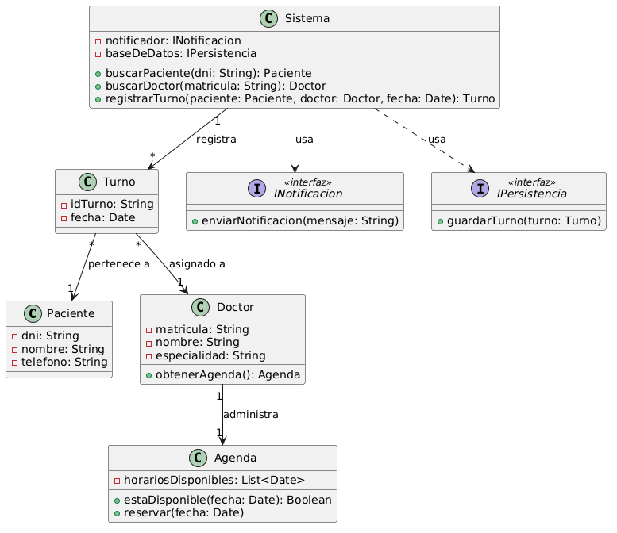

# Anexo Funcional: Caso de Uso 1 - Solicitar Turno

**Datos del Estudiante:**
- **Nombre y Apellido:** Valeria Silva
- **Matrícula:** 156612
- **Rol:** Analista Funcional CU1

## 1. Descripción y Trazabilidad
**Nombre del Caso de Uso:** Solicitar Turno
**Actores Involucrados:** Paciente, Sistema, Notificador (Sistema Externo)
**Descripción:** Este caso de uso permite a un Paciente solicitar un turno médico con un Doctor en una fecha y horario específicos.

**Trazabilidad explícita con Requisitos Funcionales:**
* **RF1 (Permitir solicitar turnos):** Satisfecho por el flujo principal de interacción. *Clases involucradas: `Paciente`, `Sistema`, `Turno`.*
* **RF2 (Validar disponibilidad de agenda):** Satisfecho mediante la consulta previa al registro. *Clases involucradas: `Doctor`, `Agenda`.*
* **RF3 (Notificar al paciente):** Satisfecho tras la confirmación exitosa de la instanciación del turno. *Clases involucradas: `INotificacion`, `Sistema`.*

## 2. Diagramas de Comportamiento
* **Diagrama de Casos de Uso:** 
* **Diagrama de Actividades:** 
* **Diagrama de Secuencia:** 

## 3. Diseño Orientado a Objetos

### 3.1 Diagrama de Clases

### 3.2 Pseudocódigo Orientado a Objetos

> // Instanciación principal e inyección de dependencias (DIP)
> INotificacion notificador = new NotificadorEmail()
> IPersistencia baseDeDatos = new PersistenciaBD()
> Sistema sistemaTurnos = new Sistema(notificador, baseDeDatos)
> 
> // Identificación de los actores
> Paciente pacienteActual = sistemaTurnos.buscarPaciente("12345678")
> Doctor doctorSeleccionado = sistemaTurnos.buscarDoctor("MAT-9988")
> 
> // Colaboración entre clases para verificar disponibilidad
> Agenda agendaDoctor = doctorSeleccionado.obtenerAgenda()
> Fecha fechaSolicitada = new Fecha("2026-06-15 10:00")
> 
> if (agendaDoctor.estaDisponible(fechaSolicitada)) {
>     // SRP: La lógica de creación se centraliza en el Sistema
>     Turno nuevoTurno = sistemaTurnos.registrarTurno(pacienteActual, doctorSeleccionado, fechaSolicitada)
>     
>     // Persistencia y colaboración con la interfaz de notificación
>     baseDeDatos.guardarTurno(nuevoTurno)
>     notificador.enviarNotificacion("Su turno ha sido confirmado.")
> } else {
>     notificador.enviarNotificacion("El horario seleccionado no está disponible en la agenda.")
> }