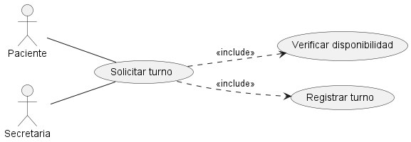
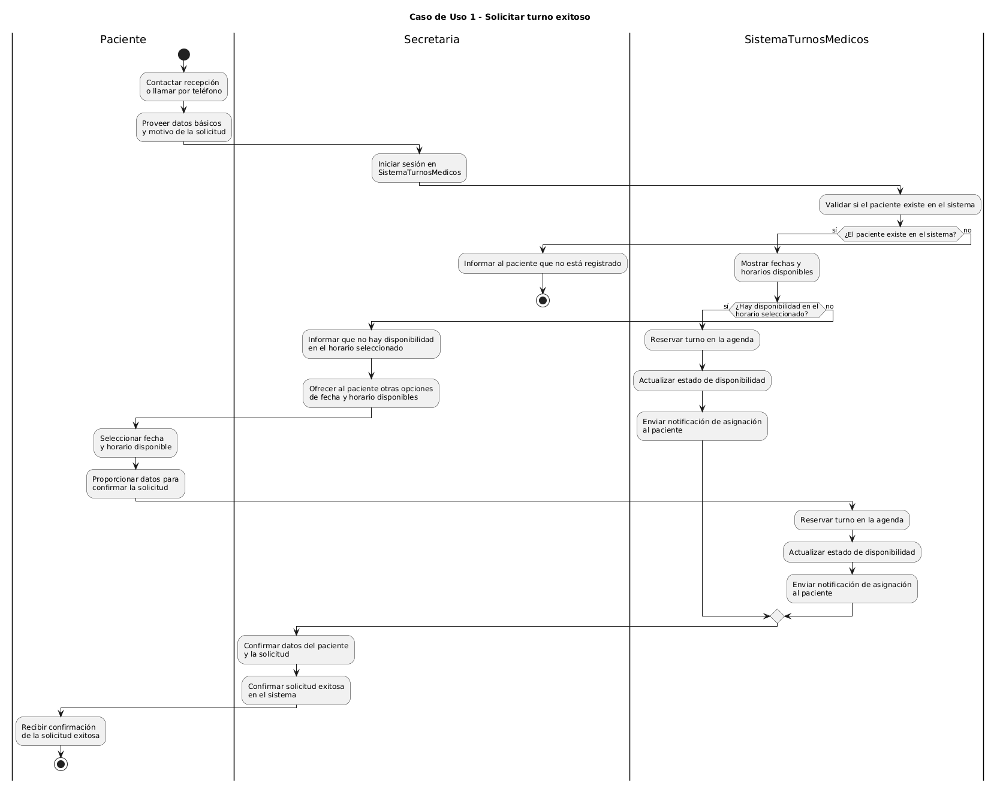
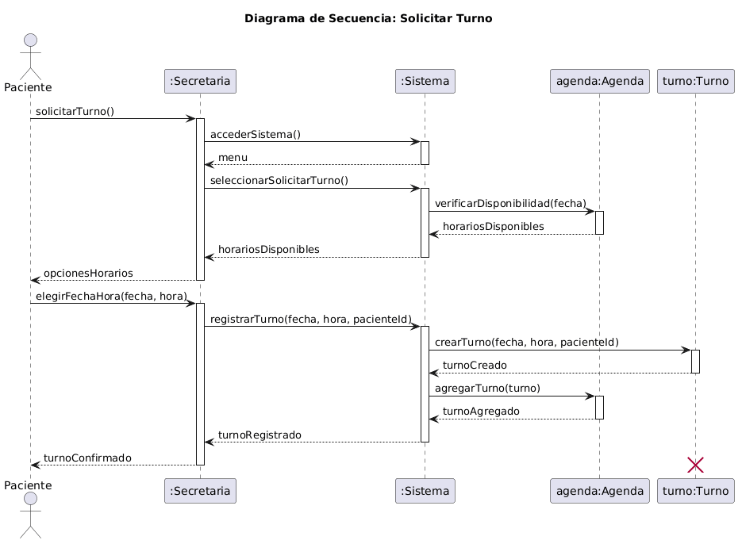
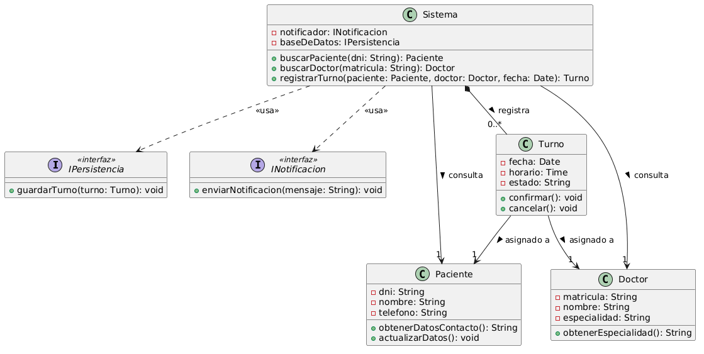

# Anexo Funcional: Caso de Uso 1 - Solicitar Turno

**Datos del Estudiante:**
- **Nombre y Apellido:** Valeria Silva
- **Matrícula:** 156612
- **Rol:** Analista Funcional CU1

## 1. Descripción y Trazabilidad con Requisitos Funcionales

**Actor/es:** Paciente, Secretaria

**Objetivo:** Permite al paciente solicitar un turno médico en una fecha disponible mediante la secretaria, registrando la reserva en el sistema y disparando una notificación.

**Flujo principal:**
1. El paciente se comunica a la recepción o llama por teléfono.
2. La secretaria ingresa al sistema y solicita buscar disponibilidad para una especialidad/doctor.
3. El sistema muestra los horarios y fechas disponibles.
4. El paciente elige una fecha y horario.
5. La secretaria confirma la selección en el sistema ingresando los datos del paciente.
6. El sistema registra el turno en la base de datos y actualiza la agenda del médico.
7. El sistema envía una notificación automática al paciente.

**Flujos alternativos:**
- **A1 - Sin disponibilidad:** Si en el paso 3 el sistema detecta que no hay turnos disponibles para los parámetros buscados, advierte a la secretaria para que informe al paciente y finaliza el caso de uso.
- **A2 - Cancelación en proceso:** Si en el paso 4 el paciente decide no aceptar ninguna de las opciones, la secretaria cancela la operación y no se efectúan cambios en la base de datos.

**Requisitos funcionales que satisface:**

| ID | Requisito Funcional (texto exacto de introduccion.md) | Cómo lo satisface este caso de uso |
|----|------------------------------------------------------|-------------------------------------|
| RF1 | El sistema debe permitirle a la secretaria crear, reprogramar y cancelar los turnos médicos. | Satisfecho por el flujo principal de interacción, ya que detalla los pasos mediante los cuales la Secretaria ingresa los datos y el sistema efectiviza la reserva del turno, guardando el registro en la base de datos y actualizando la agenda. |
| RF3 | El sistema debe enviar recordatorios automáticos a los pacientes el día anterior a su turno médico. El mismo se debe enviar mediante Whatsapp. | Queda satisfecho en el paso final del flujo, ya que, inmediatamente después de la confirmación y guardado del turno, el sistema utiliza abstracciones de mensajería para despachar automáticamente la alerta por WhatsApp al paciente. |

---

## 2. Diagrama de Casos de Uso



**Actores y relaciones:**
- **Paciente:** Inicia la interacción comunicándose con la recepción, siendo el beneficiario final del proceso.
- **Secretaria:** Actor principal que interactúa directamente con la interfaz del sistema para realizar la reserva.
- **Include/Extend:** Se utiliza una relación de inclusión (`«include»`) hacia los subprocesos "Verificar disponibilidad" y "Notificar paciente", ya que son comportamientos obligatorios que el sistema debe ejecutar siempre para que el turno se considere exitosamente solicitado.

---

## 3. Diagrama de Actividades



**Swimlanes:** 
- **Carril Secretaria:** Representa las acciones manuales y de interacción humana con la interfaz (ej. ingresar datos, seleccionar horario).
- **Carril Sistema:** Representa la lógica interna de la aplicación, consultas a la base de datos y tareas automatizadas (ej. validar agenda, guardar registro, notificar).

**Decisiones clave del flujo:** 
- **[¿Hay disponibilidad?]:** Bifurcación que se dispara tras consultar la agenda. Si la condición es *Verdadera*, el flujo avanza hacia la selección del horario; si es *Falsa*, se desvía hacia el flujo alternativo para informar al paciente y finalizar.

---

## 4. Diagrama de Secuencia



**Participantes:** `:Secretaria` (Actor), `:Sistema` (Controlador), `:Agenda` (Entidad), `:Turno` (Entidad), e `:INotificacionService` (Servicio/Interfaz).

**Mensajes clave:**
- `consultarDisponibilidad(fecha, doctor)` → Produce la lectura de la base de datos y retorna una lista de horarios libres.
- `registrarTurno(datosTurno)` → Produce la instanciación de un nuevo objeto Turno y su persistencia en el repositorio.
- `enviarNotificacion(paciente, turno)` → Produce el despacho del mensaje automatizado vía WhatsApp a través de la interfaz correspondiente.

**Objetos temporales destruidos:** 
- `pantallaBusqueda`: Se destruye de la memoria una vez que la secretaria confirma la reserva, ya que la interfaz de usuario no necesita persistir tras finalizar la transacción.

---

## 5. Diagrama de Clases del Caso de Uso



**Clases involucradas:**


| Clase | Responsabilidad | Tarjeta CRC |
|-------|-----------------|-------------|
| `Sistema` | Orquestar el flujo, recibir los inputs de la interfaz y delegar tareas a los servicios. | [01-tarjeta-crc-sistema.md](../../herramientas-agile/tarjetas-crc/01-tarjeta-crc-sistema.md) |
| `Agenda` | Conocer los horarios libres y ocupados, y bloquear las franjas horarias solicitadas. | [02-tarjeta-crc-agenda.md](../../herramientas-agile/tarjetas-crc/02-tarjeta-crc-agenda.md) |
| `Turno` | Conocer los datos específicos de la reserva (fecha, hora, paciente) y mantener su estado. | [03-tarjeta-crc-turno.md](../../herramientas-agile/tarjetas-crc/03-tarjeta-crc-turno.md) |
| `Paciente` | Conocer sus datos personales y de contacto para que el sistema pueda enviar notificaciones. | [04-tarjeta-crc-paciente.md](../../herramientas-agile/tarjetas-crc/04-tarjeta-crc-paciente.md) |

**Relaciones UML:**

| Relación | Clases | Justificación |
|----------|--------|---------------|
| Asociación | `Sistema` → `Agenda` | El sistema necesita instanciar o consultar la agenda del doctor para validar la disponibilidad horaria solicitada. |
| Asociación | `Sistema` → `Turno` | El sistema es el responsable de instanciar, crear y guardar el nuevo registro del turno. |
| Asociación | `Turno` → `Paciente` | Cada turno reservado debe pertenecer y estar obligatoriamente vinculado a un único paciente registrado. |

---

## 6. Pseudocódigo

```text
INICIO Solicitar turno

// Contexto: El paciente solicitó atención y la secretaria inicia el proceso en la UI
Sistema sistemaTurnos = nuevo Sistema()

// El sistema delega la búsqueda a la entidad correspondiente del dominio
Agenda agendaDoctor = sistemaTurnos.obtenerAgenda(idDoctor)
Lista<Horario> horariosLibres = agendaDoctor.consultarDisponibilidad(fechaDeseada)

// ¿Hay disponibilidad en la agenda?
SI horariosLibres.contiene(horarioElegido)
    // Instanciación principal de la entidad
    Turno nuevoTurno = nuevo Turno(idPaciente, idDoctor, fechaDeseada, horarioElegido)
    
    // Mutación de estado y persistencia
    sistemaTurnos.guardarTurno(nuevoTurno)
    agendaDoctor.bloquearHorario(fechaDeseada, horarioElegido)
    
    // Inyección de dependencias para disparo de automatización
    INotificacionService notificador = sistemaTurnos.getServicioNotificacion()
    notificador.enviar(idPaciente, "Su turno ha sido confirmado.")
    
    Retornar "Turno solicitado y registrado con éxito."
SINO
    // Flujo alternativo A1
    Retornar "Error: No hay turnos disponibles para esa fecha y horario."
FIN SI

FIN
