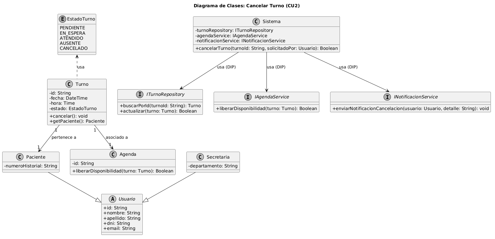

# Anexo Funcional: CU2 - Cancelar Turno

## 📌 Datos del Estudiante
- **Nombre y Apellido:** Carola Benvenuto
- **Número de Matrícula:** 158686
- **Carrera:** Tecnicatura Universitaria en Programación de Sistemas
- **Materia:** Diseño Orientado a Objetos
- **Profesor:** Lic. Matías Velasquez
- **Cuatrimestre/Año:** 1º Bimestre / 2026
- **Rol asignado para esta entrega:** Analista Funcional de Casos de Uso 2 y 3

---

## 1. Descripción del Caso de Uso y Trazabilidad
El sistema permite que un Paciente o una Secretaria soliciten la cancelación de una cita médica previamente agendada. El flujo gestiona la baja del registro, revierte la ocupación del bloque horario en la agenda del profesional de la salud y dispara los mecanismos de notificación digital automatizados a los actores involucrados.

### Mapeo de Trazabilidad Explícita:
* **RF-04 (Cancelar Turnos):** Satisfecho mediante el método de orquestación en la controladora del sistema y la mutación de estado en la entidad del dominio.
* **RF-12 (Notificación Automática):** Satisfecho mediante el uso de abstracciones de mensajería inyectadas en el flujo de cancelación.

---

## 2. Diagrama de Casos de Uso (A2)
El comportamiento funcional de este módulo se encuentra tipificado en el modelo general de casos de uso de la Actividad N° 2. 


* **Descripción breve:** El diagrama (Ref: image_78a7e4.png) expone que tanto el actor `Paciente` como el actor `Secretaria` pueden iniciar el caso de uso principal `Cancelar turno`. Este último incluye de manera obligatoria (`«include»`) la ejecución secuencial de los subprocesos `Buscar turno`, `Liberar disponibilidad` y `Notificar cancelación`.

---

## 3. Diagrama de Actividades (A3)
El flujo operativo y las bifurcaciones lógicas del proceso de cancelación se encuentran documentados en el artefacto de la Actividad N° 3.


* **Descripción breve:** El flujo inicia con la recepción del identificador del turno, evalúa la existencia del registro en el repositorio y, ante una resolución positiva, procede en paralelo a modificar el estado de la cita, liberar el bloque de la agenda del médico y despachar la alerta de confirmación.

---

## 4. Diagrama de Secuencia (A3)
La interacción cronológica y el paso de mensajes entre los objetos del sistema durante la ejecución de este caso de uso se detallan a continuación.


* **Descripción breve:** Describe la secuencia de llamadas desde la interfaz de usuario hacia el controlador `Sistema`, el cual invoca secuencialmente al repositorio de datos para recuperar la entidad, ejecuta la cancelación y delega a las interfaces correspondientes la liberación de la agenda y el envío de notificaciones.

---

## 5. Diagrama de Clases Parcial y Relaciones UML
El diseño estructural específico para dar soporte a este comportamiento se encuentra implementado bajo principios SOLID en el archivo `02-clases-cancelar-turno-02.puml`.



### Tabla de Relaciones Estructurales:
| Origen | Relación UML | Destino | Multiplicidad / Nota |
| :--- | :--- | :--- | :--- |
| `Paciente` | Herencia (`--\|>`) | `Usuario` | Especialización de entidad general. |
| `Secretaria` | Herencia (`--\|>`) | `Usuario` | Especialización de entidad general. |
| `Turno` | Asociación (`-->`) | `Paciente` | 1 a 1 (Un turno pertenece a un paciente). |
| `Turno` | Asociación (`-->`) | `Agenda` | 1 a 1 (Asociado al bloque de la agenda médica). |
| `Sistema` | Asociación (`-->`) | `ITurnoRepository` | Inversión de Dependencias (DIP) mediante inyección. |
| `Sistema` | Asociación (`-->`) | `IAgendaService` | Inversión de Dependencias (DIP) mediante inyección. |
| `Sistema` | Asociación (`-->`) | `INotificacionService` | Inversión de Dependencias (DIP) mediante inyección. |

---

## 6. Pseudocódigo Orientado a Objetos
A continuación se detalla la especificación algorítmica completa que modela la colaboración entre los objetos de dominio y los servicios abstractos, garantizando el cumplimiento de SRP y DIP:

```text
Clase Sistema {
    Atributos:
        - repositorioTurno: ITurnoRepository
        - agendaService: IAgendaService
        - notificacionService: INotificacionService

    Metodo cancelarTurno(turnoId: String, solicitadoPor: Usuario): Boolean {
        // 1. Localización de la entidad mediante abstracción de persistencia
        Turno turnoActual = repositorioTurno.buscarPorId(turnoId)
        
        Si (turnoActual == Nulo) {
            Excepcion("El identificador de turno provisto no es válido.")
            Retornar Falso
        }
        
        // 2. Modificación del estado interno del objeto de negocio (SRP)
        turnoActual.cancelar()
        Boolean persistenciaExitosa = repositorioTurno.actualizar(turnoActual)
        
        Si (NOT persistenciaExitosa) {
            Excepcion("Error interno al procesar la actualización del estado.")
            Retornar Falso
        }
        
        // 3. Invocación al servicio de Agenda para liberar el bloque horario
        Boolean agendaLiberada = agendaService.liberarDisponibilidad(turnoActual)
        
        Si (NOT agendaLiberada) {
            // Log de advertencia para auditoría técnica, no bloquea el flujo principal
            Imprimir("Advertencia: No se pudo liberar el bloque horario de forma automática.")
        }
        
        // 4. Despacho de la notificación utilizando el contrato abstracto (DIP)
        String detalleMensaje = "Notificación formal: El turno médico ha sido cancelado exitosamente."
        notificacionService.enviarNotificacionCancelacion(turnoActual.getPaciente(), detalleMensaje)
        
        Retornar Verdadero
    }
}