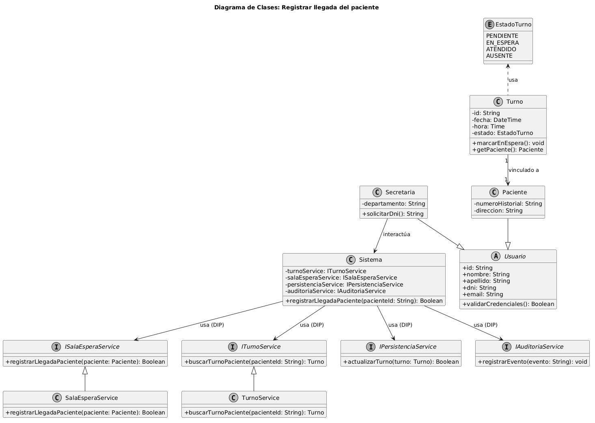

# Caso de Uso N° 2 - Registrar llegada del paciente

---

## 1. Descripción y Trazabilidad con Requisitos Funcionales

**Actor/es:** Secretaria, Paciente

**Objetivo:** Registrar formalmente la presencia física del paciente en la clínica para confirmar su turno programado y asignarle un lugar en la sala de espera.

**Flujo principal:**
1. El Paciente se presenta ante la Secretaria e informa su arribo.
2. La Secretaria solicita el documento de identidad al Paciente.
3. La Secretaria ingresa el DNI en el sistema para verificar la existencia de un turno programado para la fecha y hora actual.
4. El Sistema valida que el turno existe y se encuentra en estado PENDIENTE.
5. El Sistema cambia el estado del turno a EN_ESPERA.
6. El Sistema registra la hora de llegada exacta del paciente y lo añade a la lista de la sala de espera.
7. El Sistema confirma el registro exitoso en la pantalla de la Secretaria.

**Requisitos funcionales que satisface:**

| ID | Requisito Funcional (texto exacto de introduccion.md) | Cómo lo satisface este caso de uso |
|----|------------------------------------------------------|-------------------------------------|
| RF-02 | El sistema debe permitir registrar la llegada de los pacientes a la clínica. | Permite a la secretaria ingresar el arribo físico del paciente, cambiando el estado de su turno y pasándolo a la sala de espera de forma operativa. |
| RF-09 | El sistema debe mantener una lista de espera actualizada en tiempo real para cada consultorio. | Al confirmar la llegada, el sistema inserta automáticamente al paciente en la estructura interna de la sala de espera vinculada al médico. |

---

## 2. Diagrama de Casos de Uso


**Actores y relaciones:**
- **Secretaria** → Actor principal del flujo de interfaz que interactúa de manera directa con el sistema para buscar el turno del paciente e ingresar la confirmación.
- **Paciente** → Actor secundario que inicia la acción física al presentarse en el mostrador de recepción y proveer sus datos de identificación.
- **Include (Verificar turno)** → El flujo requiere obligatoriamente comprobar que el paciente posea una cita válida agendada previamente para poder avanzar con la admisión.
- **Include (Marcar en espera)** → Operación automática e imprescindible que modifica el ciclo de vida del turno una vez validada la presencia del paciente.

---

## 3. Diagrama de Actividades


**Swimlanes:**
- **Paciente:** Representa las acciones iniciales del usuario del dominio (presentarse en recepción y proveer documentación).
- **Secretaria:** Carril de interfaz encargado de la entrada de datos (tipear DNI) y la visualización de las respuestas del software.
- **Sistema:** Carril técnico que ejecuta las reglas de negocio, consultas lógicas a la persistencia y cambios de estado del dominio.

**Decisiones clave del flujo:**
- **¿Existe turno vigente?** Bifurcación en el carril del Sistema. Si el turno es hallado en la fecha del día, prosigue con la asignación de estado; si no se encuentra o ya caducó, se desvía al flujo alternativo de rechazo o redirección manual.

---

## 4. Diagrama de Secuencia


**Participantes:**
- `io : Secretaria` (Línea de vida de actor/interfaz)
- `sys : Sistema` (Clase de control/orquestación principal)
- `turnoService : ITurnoService` (Abstracción de interfaz de lógica de turnos)
- `salaEsperaService : ISalaEsperaService` (Abstracción de interfaz de lista de espera)
- `t : Turno` (Instancia de entidad del dominio)

**Mensajes clave:**
- `verificarTurno(pacienteId)` → Enviado de Secretaria a Sistema para iniciar la búsqueda lógica.
- `marcarTurnoEnEspera(turno)` → Invocación interna al servicio para actualizar el estado del objeto en la capa lógica.
- `registrarEnSala(paciente, horaLlegada)` → Mensaje enviado al servicio de sala de espera para incorporar la entidad del paciente al listado dinámico del consultorio.

---

## 5. Diagrama de Clases del Caso de Uso



**Clases involucradas:**

| Clase | Responsabilidad (según tarjeta CRC) | Tarjeta CRC |
|-------|-------------------------------------|-------------|
| Sistema | Orquestador principal del sistema clínico, encargado de delegar las operaciones de negocio a los servicios abstractos correspondientes. | [08-tarjeta-crc-sistema.md](../../herramientas-agile/tarjetas-crc/03-tarjeta-crc-secretaria.md) |
| Secretaria | Personal administrativo responsable de interactuar con la interfaz del sistema para notificar y registrar eventos de atención al paciente. | [03-tarjeta-crc-secretaria.md](../../herramientas-agile/tarjetas-crc/03-tarjeta-crc-secretaria.md) |
| Turno | Representar la cita médica pactada, controlando sus datos horarios, profesional asignado y sus transiciones de estado de negocio. | [05-tarjeta-crc-turno.md](../../herramientas-agile/tarjetas-crc/05-tarjeta-crc-turno.md) |
| SalaEspera | Gestionar el agrupamiento dinámico y orden cronológico de los pacientes que se encuentran físicamente listos para ser llamados por el médico. | [07-tarjeta-crc-sala-espera.md](../../herramientas-agile/tarjetas-crc/07-tarjeta-crc-sala-espera.md) |

**Relaciones UML:**

| Relación | Clases | Justificación |
|----------|--------|---------------|
| Asociación Directa | `Sistema` → `ITurnoService` | El sistema mantiene una referencia estructural hacia la interfaz del servicio para desacoplar la lógica de turnos de la implementación física (DIP). |
| Agregación | `SalaEspera` o-- `Paciente` | Una sala de espera agrupa múltiples instancias de pacientes de forma temporal. Si la sala se destruye, los pacientes siguen existiendo de manera independiente. |

---

## 6. Pseudocódigo

```text
INICIO Registrar llegada del paciente

// Contexto: El paciente se presenta físicamente en la recepción y la Secretaria inicia el registro.
// Se asume que el objeto 'sys' (Sistema) se encuentra instanciado y configurado con sus servicios.

LEER pacienteId desde la interfaz

// El sistema coordina la verificación del turno invocando de forma segura al servicio abstracto
Turno turnoExistente = sys.verificarTurno(pacienteId)

SI turnoExistente != NULL Y turnoExistente.estado == EstadoTurno.PENDIENTE
    
    // Cambiar el estado del objeto de dominio a En Espera
    sys.marcarEnEspera(turnoExistente)
    
    // Obtener la instancia del paciente vinculada al turno
    Paciente pacienteActual = turnoExistente.getPaciente()
    DateTime horaActual = ObtenerHoraSistema()
    
    // Delegar al servicio de sala de espera la inserción del paciente en la lista del día
    sys.registrarLlegada(pacienteActual)
    
    MOSTRAR_MENSAJE "Registro de llegada completado con éxito. Paciente derivado a sala de espera."
SINO
    MOSTRAR_MENSAJE "Error: No se encontró ningún turno pendiente para el paciente en la fecha actual."
FIN SI

FIN