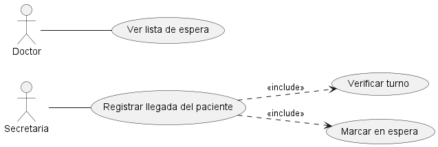

# Anexo Funcional: CU3 - Registrar Llegada del Paciente

## 📌 Datos del Estudiante
- **Nombre y Apellido:** Carola Benvenuto
- **Número de Matrícula:** 158686
- **Carrera:** Tecnicatura Universitaria en Programación de Sistemas
- **Materia:** Diseño Orientado a Objetos
- **Profesor:** Lic. Matías Velasquez
- **Cuatrimestre/Año:** 1º Cuatrimestre / 2026
- **Rol asignado para esta entrega:** Analista Funcional de Casos de Uso 2 y 3

---

## 1. Descripción del Caso de Uso y Trazabilidad

**Actor/es:** Secretaria, Paciente

**Objetivo:** Registrar formalmente la presencia física del paciente en la clínica para confirmar su turno programado y asignarle un lugar en la sala de espera.

**Flujo principal:**
1. El Paciente se presenta ante la Secretaria e informa su arribo.
2. La Secretaria selecciona la instancia del Paciente que se encuentra físicamente en el mostrador.
3. La Secretaria solicita al sistema registrar la llegada pasando la instancia del Paciente y la fecha actual.
4. El Sistema valida que la instancia del turno vinculado al Paciente existe y se encuentra en estado pendiente.
5. El Sistema cambia el estado del turno registrando la asistencia.
6. El Sistema añade la instancia del Paciente a la lista de la sala de espera.
7. El Sistema confirma el registro exitoso en la pantalla de la Secretaria.

### Mapeo de Trazabilidad Explícita:
| ID | Requisito Funcional (texto exacto de introduccion.md) | Cómo lo satisface este caso de uso |
|----|------------------------------------------------------|-------------------------------------|
| **RF-02** | El sistema debe permitir registrar la llegada de los pacientes a la clínica. | Permite a la secretaria ingresar el arribo físico del paciente, cambiando el estado de su turno y pasándolo a la sala de espera de forma operativa. |
| **RF-09** | El sistema debe mantener una lista de espera actualizada en tiempo real para cada consultorio. | Al confirmar la llegada, el sistema inserta automáticamente al paciente en la estructura interna de la sala de espera vinculada al médico. |

---

## 2. Diagrama de Casos de Uso (A2)
El comportamiento funcional de este módulo se encuentra tipificado en el modelo general de casos de uso de la Actividad N° 2.

  

**Actores y relaciones:**
- **Secretaria** → Actor principal del flujo de interfaz que interactúa de manera directa con el sistema para buscar el turno del paciente e ingresar la confirmación.
- **Paciente** → Actor secundario que inicia la acción física al presentarse en el mostrador de recepción y proveer sus datos de identificación.
- **Include (Verificar turno)** → El flujo requiere obligatoriamente comprobar que el paciente posea una cita válida agendada previamente para poder avanzar con la admisión.
- **Include (Marcar en espera)** → Operación automática e imprescindible que modifica el ciclo de vida del turno una vez validada la presencia del paciente.

---

## 3. Diagrama de Actividades (A3)
El flujo operativo y las bifurcaciones lógicas del proceso de admisión se encuentran documentados en el artefacto de la Actividad N° 3.


**Swimlanes:**
- **Paciente:** Representa las acciones iniciales del usuario del dominio (presentarse en recepción y proveer documentación).
- **Secretaria:** Carril de interfaz encargado de la entrada de datos (selección del paciente) y la visualización de las respuestas del software.
- **Sistema:** Carril técnico que ejecuta las reglas de negocio, validaciones lógicas entre objetos del dominio y cambios de estado.

**Decisiones clave del flujo:**
- **¿Existe turno vigente?** Bifurcación en el carril del Sistema. Si la instancia del turno es hallada en la fecha del día, prosigue con la asignación de estado; si no se encuentra o ya caducó, se desvía al flujo alternativo de rechazo.

---

## 4. Diagrama de Secuencia (A3)
La interacción cronológica y el paso de mensajes entre los objetos del sistema durante la ejecución de este caso de uso se detallan a continuación.


**Participantes:**
- `io : InterfazSecretaria` (Línea de vida de interfaz de usuario)
- `controlador : ControladorAsistencia` (Clase de control/orquestación del proceso)
- `turno : Turno` (Instancia de entidad del dominio de la cita médica)
- `salaEspera : SalaEspera` (Entidad encargada de agrupar los pacientes del día)

**Mensajes clave:**
- `registrarLlegada(paciente, fechaActual)` → Mensaje de inicialización enviado desde la interfaz al controlador pasándole las instancias correspondientes del dominio.
- `obtenerTurnoActivo(fechaActual)` → Mensaje enviado al objeto Turno para comprobar su vigencia temporal.
- `marcarEnEspera()` → Mensaje de mutación interna enviado a la entidad Turno para alterar su propio estado de negocio.
- `agregarPaciente(paciente)` → Mensaje enviado al objeto SalaEspera para encolar al paciente físicamente listo.

---

## 5. Diagrama de Clases Parcial y Relaciones UML
El diseño estructural específico para dar soporte a este comportamiento se encuentra implementado bajo principios SOLID en el archivo `03-clases-registrar-llegada-03.puml`.


### Clases involucradas:
| Clase | Responsabilidad (según tarjeta CRC) | Tarjeta CRC |
|-------|-------------------------------------|-------------|
| **ControladorAsistencia** | Orquestador del flujo de asistencia, encargado de coordinar los mensajes de negocio directamente entre los objetos del dominio involucrados. | [08-tarjeta-crc-sistema.md](../../herramientas-agile/tarjetas-crc/08-tarjeta-crc-sistema.md) |
| **InterfazSecretaria** | Responsable de interactuar con el personal administrativo para notificar y renderizar los eventos de atención al paciente. | [03-tarjeta-crc-secretaria.md](../../herramientas-agile/tarjetas-crc/03-tarjeta-crc-secretaria.md) |
| **Secretaria** | Personal administrativo responsable de validar la identidad del paciente e ingresar el registro operativo de su arribo físico. | [03-tarjeta-crc-secretaria.md](../../herramientas-agile/tarjetas-crc/03-tarjeta-crc-secretaria.md) |
| **Turno** | Representar la cita médica pactada, controlando sus datos horarios, profesional asignado y sus transiciones de estado de negocio. | [05-tarjeta-crc-turno.md](../../herramientas-agile/tarjetas-crc/05-tarjeta-crc-turno.md) |
| **SalaEspera** | Gestionar el agrupamiento dinámico y orden cronológico de los pacientes que se encuentran físicamente listos para ser llamados por el médico. | [07-tarjeta-crc-sala-espera.md](../../herramientas-agile/tarjetas-crc/07-tarjeta-crc-sala-espera.md) |
| **Paciente** | Representar al sujeto de atención médica del sistema, almacenando su información personal y vinculación con sus citas. | [02-tarjeta-crc-paciente.md](../../herramientas-agile/tarjetas-crc/02-tarjeta-crc-paciente.md) |
| **Usuario** | Entidad abstracta del dominio que define los atributos básicos de identificación y credenciales comunes para los actores del sistema. | [01-tarjeta-crc-usuario.md](../../herramientas-agile/tarjetas-crc/01-tarjeta-crc-usuario.md) |

### Tabla de Relaciones Estructurales:
| Origen | Relación UML | Destino | Multiplicidad / Nota |
| :--- | :--- | :--- | :--- |
| `Paciente` | Herencia (`--\|>`) | `Usuario` | Especialización de entidad general. |
| `Secretaria` | Herencia (`--\|>`) | `Usuario` | Especialización de entidad general. |
| `Turno` | Asociación (`-->`) | `Paciente` | 1 a 1 (Un turno pertenece a un paciente). |
| `SalaEspera` | Agregación (`-->`) | `Paciente` | 1 a muchas (Agrupa temporalmente a los pacientes en espera). |
| `ControladorAsistencia` | Dependencia (`..>`) | `Turno` | Operación directa sobre entidades de negocio. |
| `ControladorAsistencia` | Dependencia (`..>`) | `SalaEspera` | Operación directa sobre entidades de negocio. |

---

## 6. Pseudocódigo Orientado a Objetos
A continuación se detalla la especificación algorítmica completa que modela la colaboración entre los objetos de dominio, garantizando la consistencia absoluta con las firmas del diseño orientado a objetos puro, reflejando la instanciación e interacción secuencial, y eliminando cualquier identificador relacional indirecto:

```text
Clase InterfazRecepcionista
    Método registrarLlegadaPaciente(dniPaciente)
        // La recepcionista ingresa el DNI del paciente en el sistema para anunciar que ya se encuentra en la clínica
        ControladorLlegadas.procesarLlegada(dniPaciente)
    Fin Método
    
    Método mostrarConfirmacion(mensaje)
        // La pantalla le indica a la recepcionista el resultado final de la operación
        Mostrar en pantalla(mensaje)
    Fin Método
Fin Clase

Clase ControladorLlegadas
    Método procesarLlegada(dniPaciente)
        // El sistema busca en la agenda médica si existe un turno asignado para ese paciente en el día de hoy
        turnoActual = Agenda.buscarTurnoPorDNI(dniPaciente)
        
        Si el turnoActual no existe entonces
            // Si el paciente no tiene un turno válido para hoy, se frena el proceso y se avisa a la recepcionista
            InterfazRecepcionista.mostrarConfirmacion("El paciente no posee un turno asignado para el día de hoy.")
            Retornar Falso
        Fin Si
        
        // El sistema identifica al paciente y al profesional médico vinculados a ese turno
        pacienteAsociado = turnoActual.obtenerInfoPaciente()
        medicoAsociado = turnoActual.obtenerMedico()
        
        // Se actualiza la condición del turno para reflejar que el paciente ya está en la sala de espera
        turnoActual.cambiarEstadoAEnEspera()
        
        // El sistema le envía una alerta interna al médico para notificarle que su paciente ha llegado
        medicoAsociado.recibirAlertaLlegada(pacienteAsociado)
        
        // El controlador le avisa a la interfaz que el circuito finalizó correctamente para que le informe a la recepcionista
        InterfazRecepcionista.mostrarConfirmacion("Llegada registrada exitosamente. El paciente ya se encuentra en espera.")
        
        Retornar Verdadero
    Fin Método
Fin Clase