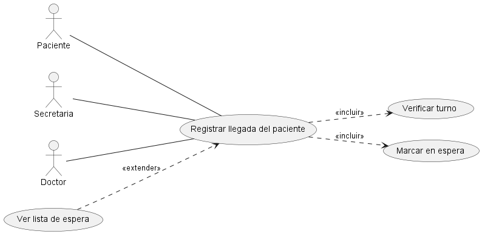
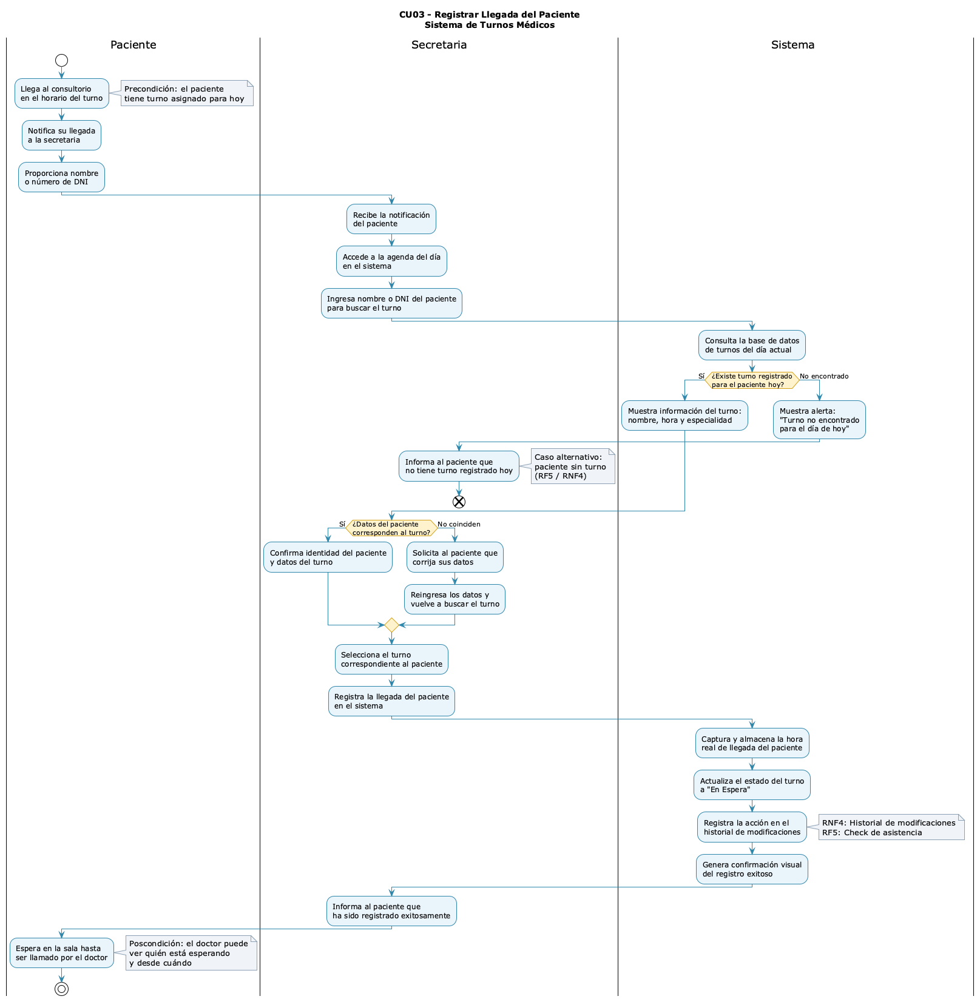
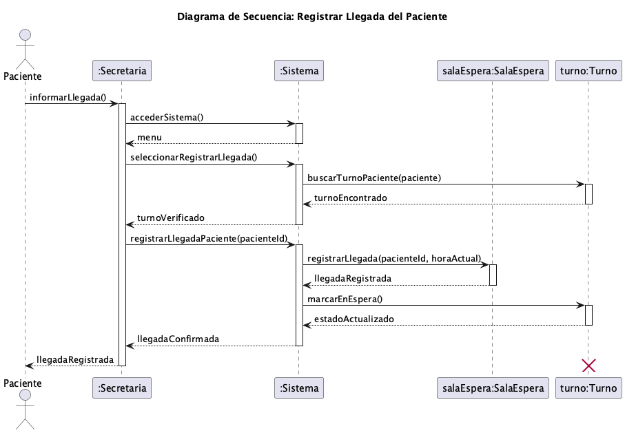
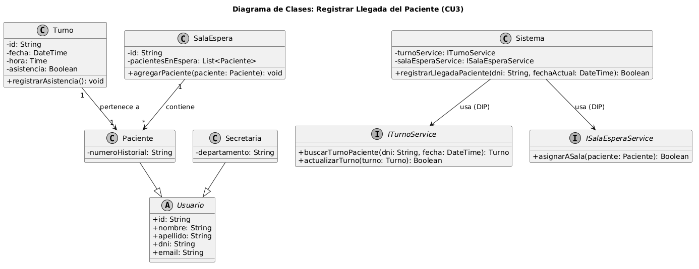

# Anexo Funcional: CU3 - Registrar Llegada del Paciente

## 📌 Datos del Estudiante
- **Nombre y Apellido:** Carola Benvenuto
- **Número de Matrícula:** 158686
- **Carrera:** Tecnicatura Universitaria en Programación de Sistemas
- **Materia:** Diseño Orientado a Objetos
- **Profesor:** Lic. Matías Velasquez
- **Cuatrimestre/Año:** 1º Cuatrimestre / 2026
- **Rol asignado para esta entrega:** Analista Funcional de Casos de Uso 2 y 3

---

## 1. Descripción del Caso de Uso y Trazabilidad

**Actor/es:** Secretaria, Paciente

**Objetivo:** Registrar formalmente la presencia física del paciente en la clínica para confirmar su turno programado y asignarle un lugar en la sala de espera.

**Flujo principal:**
1. El Paciente se presenta ante la Secretaria e informa su arribo.
2. La Secretaria solicita el documento de identidad al Paciente.
3. La Secretaria ingresa el DNI en el sistema para verificar la existencia de un turno programado para la fecha y hora actual.
4. El Sistema valida que el turno existe y se encuentra pendiente.
5. El Sistema cambia el estado del turno registrando la asistencia.
6. El Sistema añade al paciente a la lista de la sala de espera.
7. El Sistema confirma el registro exitoso en la pantalla de la Secretaria.

### Mapeo de Trazabilidad Explícita:
| ID | Requisito Funcional (texto exacto de introduccion.md) | Cómo lo satisface este caso de uso |
|----|------------------------------------------------------|-------------------------------------|
| **RF-02** | El sistema debe permitir registrar la llegada de los pacientes a la clínica. | Permite a la secretaria ingresar el arribo físico del paciente, cambiando el estado de su turno y pasándolo a la sala de espera de forma operativa. |
| **RF-09** | El sistema debe mantener una lista de espera actualizada en tiempo real para cada consultorio. | Al confirmar la llegada, el sistema inserta automáticamente al paciente en la estructura interna de la sala de espera vinculada al médico. |

---

## 2. Diagrama de Casos de Uso (A2)
El comportamiento funcional de este módulo se encuentra tipificado en el modelo general de casos de uso de la Actividad N° 2.



**Actores y relaciones:**
- **Secretaria** → Actor principal del flujo de interfaz que interactúa de manera directa con el sistema para buscar el turno del paciente e ingresar la confirmación.
- **Paciente** → Actor secundario que inicia la acción física al presentarse en el mostrador de recepción y proveer sus datos de identificación.
- **Include (Verificar turno)** → El flujo requiere obligatoriamente comprobar que el paciente posea una cita válida agendada previamente para poder avanzar con la admisión.
- **Include (Marcar en espera)** → Operación automática e imprescindible que modifica el ciclo de vida del turno una vez validada la presencia del paciente.

---

## 3. Diagrama de Actividades (A3)
El flujo operativo y las bifurcaciones lógicas del proceso de admisión se encuentran documentados en el artefacto de la Actividad N° 3.



**Swimlanes:**
- **Paciente:** Representa las acciones iniciales del usuario del dominio (presentarse en recepción y proveer documentación).
- **Secretaria:** Carril de interfaz encargado de la entrada de datos (tipear DNI) y la visualización de las respuestas del software.
- **Sistema:** Carril técnico que ejecuta las reglas de negocio, consultas lógicas a la persistencia y cambios de estado del dominio.

**Decisiones clave del flujo:**
- **¿Existe turno vigente?** Bifurcación en el carril del Sistema. Si el turno es hallado en la fecha del día, prosigue con la asignación de estado; si no se encuentra o ya caducó, se desvía al flujo alternativo de rechazo o redirección manual.

---

## 4. Diagrama de Secuencia (A3)
La interacción cronológica y el paso de mensajes entre los objetos del sistema durante la ejecución de este caso de uso se detallan a continuación.



**Participantes:**
- `io : Secretaria` (Línea de vida de actor/interfaz)
- `sys : Sistema` (Clase de control/orquestación principal)
- `turno : Turno` (Instancia de entidad del dominio concreta mapeada por el servicio)
- `salaEspera : SalaEspera` (Entidad donde se registra la cola de pacientes del día)

**Mensajes clave:**
- `registrarLlegadaPaciente(dni, fechaActual)` → Mensajes de inicialización de búsqueda desde la interfaz al orquestador.
- `buscarTurnoPaciente(dni, fecha)` → Mensaje interno delegado al modelo para constatar el registro pendiente.
- `marcarEnEspera()` → Mensaje de mutación de estado que altera el ciclo de vida de la entidad Turno.

---

## 5. Diagrama de Clases Parcial y Relaciones UML
El diseño estructural específico para dar soporte a este comportamiento se encuentra implementado bajo principios SOLID en el archivo `03-clases-registrar-llegada-03.puml`.



### Clases involucradas:
| Clase | Responsabilidad (según tarjeta CRC) | Tarjeta CRC |
|-------|-------------------------------------|-------------|
| **Sistema** | Orquestador principal del sistema clínico, encargado de delegar las operaciones de negocio a los servicios abstractos correspondientes. | [08-tarjeta-crc-sistema.md](../../herramientas-agile/tarjetas-crc/08-tarjeta-crc-sistema.md) |
| **Secretaria** | Personal administrativo responsable de interactuar con la interfaz del sistema para notificar y registrar eventos de atención al paciente. | [03-tarjeta-crc-secretaria.md](../../herramientas-agile/tarjetas-crc/03-tarjeta-crc-secretaria.md) |
| **Turno** | Representar la cita médica pactada, controlando sus datos horarios, profesional asignado y sus transiciones de estado de negocio. | [05-tarjeta-crc-turno.md](../../herramientas-agile/tarjetas-crc/05-tarjeta-crc-turno.md) |
| **SalaEspera** | Gestionar el agrupamiento dinámico y orden cronológico de los pacientes que se encuentran físicamente listos para ser llamados por el médico. | [07-tarjeta-crc-sala-espera.md](../../herramientas-agile/tarjetas-crc/07-tarjeta-crc-sala-espera.md) |

### Tabla de Relaciones Estructurales:
| Origen | Relación UML | Destino | Multiplicidad / Nota |
| :--- | :--- | :--- | :--- |
| `Paciente` | Herencia (`--\|>`) | `Usuario` | Especialización de entidad general. |
| `Secretaria` | Herencia (`--\|>`) | `Usuario` | Especialización de entidad general. |
| `Turno` | Asociación (`-->`) | `Paciente` | 1 a 1 (Un turno pertenece a un paciente). |
| `SalaEspera` | Agregación (`-->`) | `Paciente` | 1 a muchas (Agrupa temporalmente a los pacientes en espera). |
| `Sistema` | Dependencia (`..>`) | `ITurnoService` | Inversión de Dependencias (DIP). |
| `Sistema` | Dependencia (`..>`) | `ISalaEsperaService` | Inversión de Dependencias (DIP). |

---

## 6. Pseudocódigo Orientado a Objetos
A continuación se detalla la especificación algorítmica completa que modela la colaboración entre los objetos de dominio y los servicios abstractos, garantizando la consistencia absoluta con las firmas definidas en el archivo estructural `03-clases-registrar-llegada-03.puml`:

```text
Clase Sistema {
    Atributos:
        - turnoService: ITurnoService
        - salaEsperaService: ISalaEsperaService

    Metodo registrarLlegadaPaciente(dni: String, fechaActual: DateTime): Boolean {
        // 1. Localización coordinada mediante el servicio abstracto mapeado en la secuencia
        Turno turnoExistente = turnoService.buscarTurnoPaciente(dni, fechaActual)
        
        SI (turnoExistente != NULL Y turnoExistente.asistencia == Falso) {
            
            // 2. Mutación interna del estado de la entidad según el diseño estructural
            turnoExistente.marcarEnEspera()
            Boolean actualizacionExitosa = turnoService.actualizarTurno(turnoExistente)
            
            SI (NOT actualizacionExitosa) {
                Excepcion("Error interno al procesar el cambio de estado del turno.")
                Retornar Falso
            }
            
            // 3. Obtención del objeto Paciente asociado para su derivación
            Paciente pacienteActual = turnoExistente.getPaciente()
            
            // 4. Delegación estructural al servicio inyectado de la sala de espera (DIP)
            Boolean asignacionSala = salaEsperaService.registrarLlegada(pacienteActual)
            
            SI (NOT asignacionSala) {
                Imprimir("Advertencia: No se pudo registrar automáticamente en la cola física.")
            }
            
            MOSTRAR_MENSAJE "Registro de llegada completado con éxito. Paciente derivado a sala de espera."
            Retornar Verdadero
        SINO
            MOSTRAR_MENSAJE "Error: No se encontró ningún turno pendiente para el paciente en la fecha actual o la asistencia ya fue registrada."
            Retornar Falso
        FIN SI
    }
}