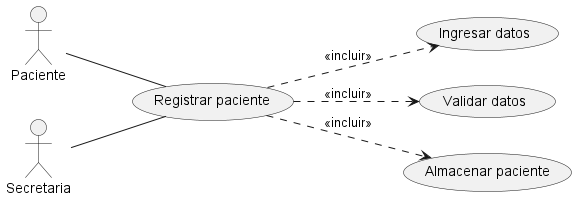
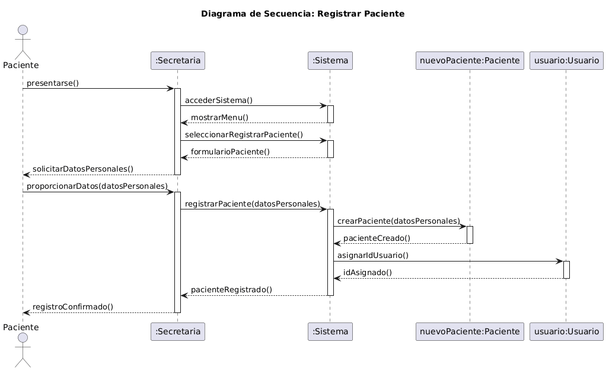
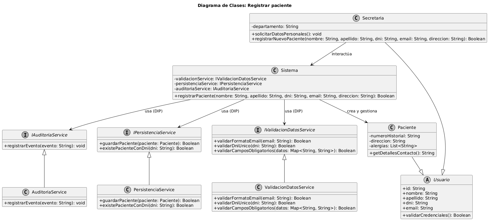

# Caso de Uso N° 3 - Registrar paciente

---

## 1. Descripción y Trazabilidad con Requisitos Funcionales

**Actor/es:** Secretaria

**Objetivo:** Dar de alta de forma segura a un nuevo paciente en el sistema de la clínica, validando sus datos personales para habilitar la posterior asignación de turnos.

**Flujo principal:**
1. El Paciente solicita ser registrado en la clínica aportando sus datos personales a la Secretaria.
2. La Secretaria inicia la opción de registro de nuevo paciente en la interfaz del sistema.
3. El Sistema solicita el ingreso de los datos obligatorios: Nombre, Apellido, DNI, Email y Dirección.
4. La Secretaria ingresa la información correspondiente.
5. El Sistema valida que los campos cumplan con el formato correcto, que el Email sea válido y que el DNI no se encuentre previamente registrado en la base de datos.
6. El Sistema crea e inserta de forma persistente la nueva entidad del Paciente.
7. El Sistema confirma el registro exitoso y muestra el número de historial clínico generado de forma automática.

**Requisitos funcionales que satisface:**

| ID | Requisito Funcional (texto exacto de introduccion.md) | Cómo lo satisface este caso de uso |
|----|------------------------------------------------------|-------------------------------------|
| RF-03 | El sistema debe permitir el alta, modificación y consulta de los datos de los pacientes. | Implementa el flujo técnico completo para el alta de nuevas entidades Paciente, resguardando la integridad de sus atributos. |
| RF-11 | El sistema debe validar que no existan duplicados de documentos de identidad en el registro de usuarios. | Delega al servicio de validación la verificación de unicidad del DNI de forma previa a la persistencia en el disco. |

---

## 2. Diagrama de Casos de Uso



**Actores y relaciones:**
- **Secretaria** → Único actor administrativo que opera el software para cargar los formularios de datos e iniciar la transacción de negocio.
- **Asociación Directa** → Vinculación estándar entre el actor Secretaria y el óvalo del caso de uso principal.

---

## 3. Diagrama de Actividades


**Swimlanes:**
- **Secretaria:** Responsable de recopilar los datos físicos e ingresarlos secuencialmente en el formulario digital.
- **Sistema:** Encargado de disparar las validaciones lógicas cruzadas y persistir el registro del nuevo paciente una vez aprobado.

**Decisiones clave del flujo:**
- **¿Datos válidos y DNI único?** Bifurcación clave ejecutada por el Sistema. Si pasa la validación de formato y unicidad de documento, avanza hacia la persistencia; si falla, el flujo se desvía mostrando un mensaje de error explícito en la pantalla de la secretaria.

---

## 4. Diagrama de Secuencia



**Participantes:**
- `io : Secretaria` (Línea de vida del actor en interfaz)
- `sys : Sistema` (Clase de control/orquestación central)
- `nuevoPaciente : Paciente` (Instancia de entidad de dominio concreta creada en la transacción)
- `usuario : Usuario` (Clase base de la jerarquía heredada)

**Mensajes clave:**
- `registrarPaciente(datosPersonales)` → Mensaje inicial que transporta la estructura de campos obligatorios.
- `crearCuentaUsuario(datosPersonales)` → Operación interna del sistema que orquesta la instanciación de la cuenta de seguridad heredada por el paciente en el dominio.

---

## 5. Diagrama de Clases del Caso de Uso



**Clases involucradas:**

| Clase | Responsabilidad (según tarjeta CRC) | Tarjeta CRC |
|-------|-------------------------------------|-------------|
| Sistema | Orquestador principal del sistema clínico, encargado de delegar las operaciones de negocio a los servicios abstractos correspondientes. | [08-tarjeta-crc-sistema.md](../../herramientas-agile/tarjetas-crc/08-tarjeta-crc-sistema.md) |
| Paciente | Entidad del dominio que hereda de Usuario, encargada de almacenar de forma segura la información clínica e historial médico de la persona. | [02-tarjeta-crc-paciente.md](../../herramientas-agile/tarjetas-crc/02-tarjeta-crc-paciente.md) |
| Secretaria | Personal administrativo responsable de interactuar con la interfaz del sistema para notificar y registrar eventos de atención al paciente. | [03-tarjeta-crc-secretaria.md](../../herramientas-agile/tarjetas-crc/03-tarjeta-crc-secretaria.md) |

**Relaciones UML:**

| Relación | Clases | Justificación |
|----------|--------|---------------|
| Asociación Estructural | `Sistema` → `IValidacionDatosService` | El sistema cuenta con una referencia directa a la abstracción de validación para desacoplar las reglas lógicas del motor central (DIP). |
| Herencia | `Paciente` --\|> `Usuario` | Un Paciente es una especialización de la clase abstracta Usuario, reutilizando atributos como DNI y nombre, e implementando polimorfismo lógico. El método `getDetallesContacto()` actúa como resolvedor de consistencia de datos de cara al subsistema de notificaciones. |

---

## 6. Pseudocódigo

```text
INICIO Registrar paciente

// Contexto: La secretaria ingresa los datos de un paciente que no existía en el padrón de la clínica.
// Se asumen inyectados los servicios requeridos que encapsulan la lógica de la secuencia.

LEER nombre, apellido, dni, email, direccion desde la interfaz

Map datosPersonales = ["nombre": nombre, "apellido": apellido, "dni": dni, "email": email, "direccion": direccion]

// Mapeo directo del mensaje crítico de secuencia
Usuario nuevaCuenta = sys.crearCuentaUsuario(datosPersonales)

SI nuevaCuenta != NULL
    esEmailValido = sys.validacionService.validarFormatoEmail(email)
    esDniUnico = sys.validacionService.validarDniUnico(dni)
    
    SI esEmailValido == TRUE Y esDniUnico == TRUE
        Paciente nuevoPaciente = (Paciente) nuevaCuenta
        nuevoPaciente.numeroHistorial = GenerarNumeroHistorialUnico()
        
        exitoPersistencia = sys.persistenciaService.guardarPaciente(nuevoPaciente)
        
        SI exitoPersistencia == TRUE
            sys.auditoriaService.registrarEvento("Alta de paciente exitosa - DNI: " + dni)
            MOSTRAR_MENSAJE "Paciente registrado correctamente."
        SINO
            MOSTRAR_MENSAJE "Error: Falló la persistencia."
        FIN SI
    SINO
        MOSTRAR_MENSAJE "Error: Validaciones de identidad rechazadas."
    FIN SI
SINO
    MOSTRAR_MENSAJE "Error: No se pudo inicializar la cuenta de usuario."
FIN SI

FIN