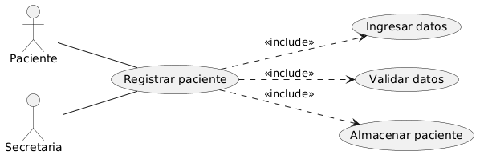
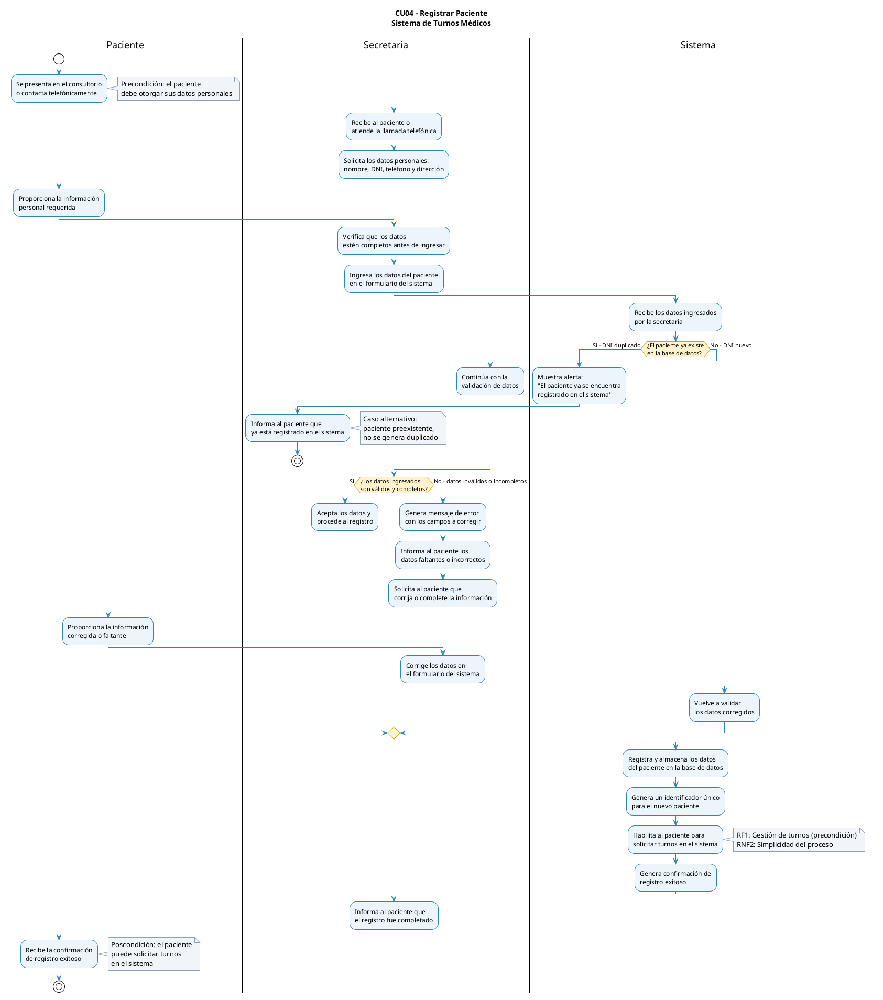

# Caso de Uso N°4 - Registrar Paciente

---

## 1. Descripción y Trazabilidad con Requisitos Funcionales

**Actor/es:** Paciente y Secretaria

**Objetivo:** Permite guardar los datos personales del paciente en el sistema para que pueda solicitar turnos.

**Flujo principal:**

1. El paciente se presenta en el consultorio o llama por teléfono. | Se recopilan datos como nombre, documento, teléfono y dirección. 
2. La secretaria solicita los datos personales del paciente. | La secretaria valida la información proporcionada.
3. El paciente proporciona la información requerida. | El sistema verifica si el paciente ya existe en la base de datos. 
4. La secretaria ingresa los datos en el sistema. | El registro se guarda y el paciente queda habilitado para pedir turnos. 
5. El sistema registra y almacena los datos del paciente. | El paciente recibe una confirmación de registro exitoso.


**Requisitos funcionales que satisface:**

| ID | Requisito Funcional (texto exacto de introduccion.md) | Cómo lo satisface este caso de uso |
|----|------------------------------------------------------|-------------------------------------|
| * **RF1 Gestión de turnos:** | El sistema debe permitirle a la secretaria crear, reprogramar y cancelar los turnos médicos. | Este caso de uso es un prerrequisito para que el paciente pueda solicitar turnos, ya que sin registrar sus datos no podría ser identificado ni asignarle un turno. |
| * **RF3 Notificar automáticamente al paciente:** | El sistema debe enviar recordatorios automáticos a los pacientes el día anterior a su turno médico. El mismo se debe enviar mediante Whatsapp. | Al registrar al paciente, el sistema almacena su número de teléfono, lo cual es necesario para enviarle los recordatorios automáticos por Whatsapp. Sin este caso de uso, el sistema no tendría la información de contacto del paciente para cumplir con este requisito. |
| * **RF5 Check de asistencia:** | El sistema debe permitir marcar con un check los pacientes que efectivamente han asistido a su turno médico, incluyendo hora de llegada y lista de espera. | Al registrar al paciente, el sistema crea un perfil con su información personal, lo cual es necesario para luego marcar su asistencia en el turno médico. Sin este caso de uso, el sistema no tendría la información del paciente para realizar el check de asistencia. |

---

## 2. Diagrama de Casos de Uso



**Actores y relaciones:**

- [Paciente]: es el actor principal que se beneficia del proceso de registro, proporcionando su información personal para ser identificado en el sistema.
- [Secretaria]: es quien interactúa directamente con el sistema para registrar al paciente.

- Asociación: se utiliza entre los actores (Paciente y Secretaria) y el caso de uso principal (Registrar paciente) porque ambos participan directamente en la ejecución del proceso, iniciándolo o aportando información necesaria para completarlo.
- <<include>>: se emplea para representar comportamientos obligatorios y reutilizables dentro del caso de uso principal. Tanto Validar datos como Ingresar datos personales forman parte necesaria del flujo de registro y siempre deben ejecutarse cuando se registra un paciente.
- No se utiliza <<extend>>: porque no existen flujos opcionales o condicionales que amplíen el comportamiento del caso de uso principal; todas las actividades modeladas son obligatorias para completar el registro.

---

## 3. Diagrama de Actividades



**Swimlanes:** Se utilizaron tres carriles: Paciente, Secretaria y Sistema. La distribución de responsabilidades refleja la participación de cada actor en el proceso de registro. El Paciente aporta y corrige la información requerida, la Secretaria actúa como intermediaria operativa encargada de recopilar e ingresar los datos, y el Sistema realiza las validaciones, controla la existencia previa del paciente y ejecuta el registro definitivo en la base de datos.

**Decisiones clave del flujo:** Verificación de existencia del paciente: el sistema evalúa si el DNI ya se encuentra registrado. Si existe, el flujo finaliza informando que el paciente ya está registrado; si no existe, continúa el proceso de alta.
Validación de datos ingresados: el sistema determina si la información proporcionada es válida y está completa. Cuando se detectan errores o datos faltantes, se solicita su corrección y el flujo retorna al proceso de validación. Si los datos son correctos, se procede al registro definitivo del paciente.
Revalidación tras correcciones: luego de que la secretaria actualiza la información observada, el sistema vuelve a ejecutar las validaciones antes de permitir el alta, garantizando la consistencia de los datos almacenados.

---

## 4. Diagrama de Secuencia

![Diagrama de Secuencia - [Registrar Paciente]](../../diagramas/05-diagramas-secuencia/05-secuencia-registrar-paciente-registrar-paciente-04.png)

**Participantes:**

Paciente: actor externo que inicia el proceso proporcionando la información necesaria para el registro.
:Secretaria: instancia de la clase Secretaria representada mediante la notación :Objeto, encargada de interactuar con el paciente y operar el sistema.
:Sistema: instancia del sistema que coordina la lógica de registro y la creación de entidades.
nuevoPaciente:Paciente: objeto de la clase Paciente representado con la notación objeto:Clase, creado durante la ejecución para almacenar los datos del nuevo paciente.
usuario:Usuario: objeto de la clase Usuario representado con la notación objeto:Clase, generado para asociar las credenciales de acceso del paciente al sistema.

**Mensajes clave:**

[registrarPaciente(datosPersonales)]: inicia el proceso de alta dentro del sistema utilizando los datos proporcionados por el paciente.
[crearPaciente(datosPersonales)]: provoca la creación de la entidad nuevoPaciente:Paciente.
[crearCuentaUsuario(datosPersonales)]: genera la cuenta de acceso asociada al nuevo paciente mediante el objeto usuario:Usuario.
[pacienteRegistrado]: confirma a la secretaria que el registro fue completado correctamente.
[registroConfirmado]: comunica al paciente el resultado exitoso del proceso.

**Objetos temporales destruidos:**
Los objetos nuevoPaciente:Paciente y usuario:Usuario son temporales dentro de la interacción modelada. Se crean durante la ejecución de los mensajes crearPaciente(datosPersonales) y crearCuentaUsuario(datosPersonales) respectivamente, y luego son destruidos (indicados mediante la "X" al final de sus líneas de vida) porque el diagrama representa únicamente el proceso de creación y registro. Una vez persistidos sus datos en el sistema, estas instancias temporales ya no participan en la interacción mostrada.

---

## 5. Diagrama de Clases del Caso de Uso

![Diagrama de Clases - [Registrar Paciente]](../../diagramas/01-diagrama-clases/04-clases-registrar-paciente-04.png)

**Clases involucradas:**

| Clase | Responsabilidad (según tarjeta CRC) | Tarjeta CRC |
|-------|-------------------------------------|-------------|
| Paciente | solicitar turno, cancelar turno, consultar mis turnos programados | [Tarjeta CRC - Paciente](../../herramientas-agile/tarjetas-crc/02-tarjeta-crc-paciente.md) |
| Secretaria | Registrar nuevo paciente en el sistema, crear o modificar turnos, cancelar turnos y liberar horarios | [Tarjeta CRC - Secretaria](../../herramientas-agile/tarjetas-crc/03-tarjeta-crc-secretaria.md) |
| Sistema | autenticar usuarios e iniciar sesión y enviar recordatorio automático al paciente | [Tarjeta CRC - Sistema](../../herramientas-agile/tarjetas-crc/08-tarjeta-crc-sistema.md) |
| Usuario | Autenticarse en el sistema, cerrar sesión y modificar perfil personal | [Tarjeta CRC - Usuario](../../herramientas-agile/tarjetas-crc/01-tarjeta-crc-usuario.md) |
| Turno | Crear reserva de cita médica | [Tarjeta CRC - Turno](../../herramientas-agile/tarjetas-crc/05-tarjeta-crc-turno.md) |


**Relaciones UML:**

| Relación | Clases | Justificación |
|----------|--------|---------------|
| Herencia | [Secretaria] → [Usuario] | La secretaria es un tipo específico de usuario del sistema y hereda sus atributos y comportamientos generales, como identificación y acceso al sistema |
|Asociación | [Secretaria] → [Sistema] | La secretaria interactúa con el sistema para validar datos y registrar pacientes durante el proceso de alta |
| Creación/Dependencia | [Sistema] → [Paciente] | El sistema crea la instancia del paciente al ejecutar el proceso de registro utilizando los datos ingresados por la secretaria |
| Asociación | [Sistema] → [Usuario] | El sistema genera la cuenta de usuario asociada al paciente mediante la operación crearCuentaUsuario(datos) |
| Asociación | [Paciente] → [Turno] | Un paciente puede tener uno o más turnos asociados, por lo que existe una relación funcional entre ambas clases |
---

## 6. Pseudocódigo

```text
INICIO Registrar Paciente

// El paciente se presenta o contacta a la secretaria para ser registrado en el sistema antes de poder solicitar turnos.

Paciente pacienteSolicitante = nuevo Paciente(datosPersonales)
Secretaria secretaria = nuevo Secretaria()
Sistema sistema = nuevo Sistema()

// La secretaria solicita y recibe los datos personales necesarios para iniciar el registro.
datosPersonales = secretaria.solicitarDatosPersonales()

// La secretaria valida que los datos mínimos estén completos antes de enviarlos al sistema.
datosValidos = secretaria.validarDatos(datosPersonales)

SI datosValidos es verdadero

    // El sistema verifica que no exista otro paciente registrado con el mismo DNI.
    dniDuplicado = sistema.validarDuplicidad(datosPersonales.dni)

    SI dniDuplicado es falso

        // El sistema registra al paciente con los datos proporcionados.
        pacienteRegistrado = sistema.registrarPaciente(datosPersonales)

        // El sistema crea la cuenta de usuario asociada al nuevo paciente.
        usuarioCreado = sistema.crearCuentaUsuario(datosPersonales)

        // La secretaria informa que el registro fue realizado correctamente.
        secretaria.registrarPaciente(datosPersonales)

        // El paciente queda habilitado para operar en el sistema y solicitar turnos.
        Retornar pacienteRegistrado

    SINO

        // El flujo alternativo se activa porque el paciente ya existe en el sistema.
        Retornar "El paciente ya se encuentra registrado"

    FIN SI

SINO

    // El flujo alternativo se activa porque los datos ingresados son inválidos o incompletos.
    Retornar "Datos personales inválidos o incompletos"

FIN SI

FIN
```
