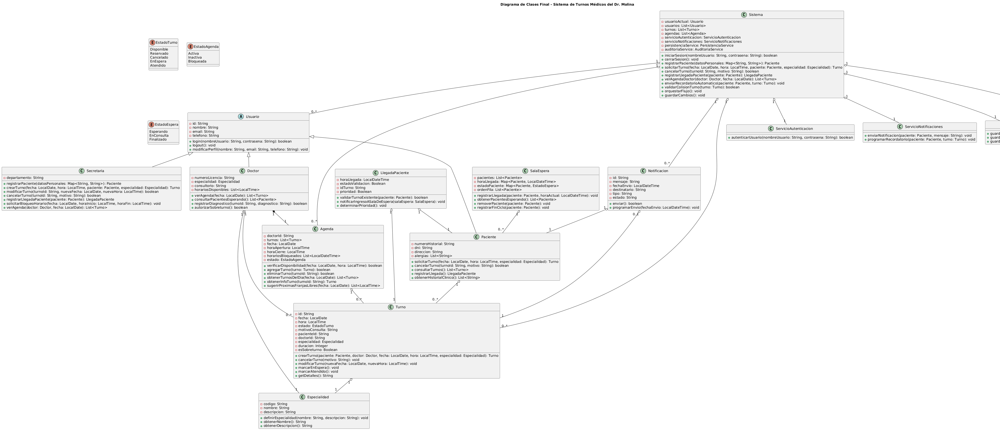

# Diagrama de Clases Final - Sistema de Turnos Médicos

## 1. Versión del Diagrama

| Versión | Casos de uso integrados | Fecha |
|---------|------------------------|-------|
| v1 | CU1 Solicitar Turno, CU2 Cancelar Turno, CU3 Registrar Llegada, CU4 Ver Agenda, CU5 Envío de Notificaciones | 2026-06-07 |

## 2. Diagrama

## 3. Clases del Sistema

| Clase | Responsabilidad (según tarjeta CRC) | Aparece en CU |
|-------|-------------------------------------|---------------|
| Usuario | Representar un actor del sistema con datos de identidad y capacidades de autenticación. | CU1, CU2, CU3, CU4, CU5 |
| Paciente | Registrar datos de paciente, solicitar y cancelar turnos, consultar turnos y registrar llegada. | CU1, CU2, CU3 |
| Secretaria | Registrar pacientes, gestionar turnos, consultar agendas y registrar llegadas. | CU1, CU2, CU3, CU4 |
| Doctor | Visualizar agenda, consultar pacientes en espera y registrar diagnósticos. | CU3, CU4 |
| Turno | Modelar la cita médica con fecha, hora, estado, paciente, doctor y especialidad. | CU1, CU2, CU3, CU4, CU5 |
| Agenda | Controlar la disponibilidad del doctor, los horarios bloqueados y los turnos del día. | CU1, CU4 |
| SalaEspera | Organizar pacientes presentes en la sala de espera y registrar su estado. | CU3 |
| LlegadaPaciente | Validar la llegada del paciente, detectar su turno y notificar ingreso a la sala de espera. | CU3 |
| Sistema | Orquestar autenticación, reservas, cancelaciones, notificaciones y persistencia. | CU1, CU2, CU3, CU4, CU5 |
| ServicioAutenticacion | Autenticar usuarios del sistema para habilitar el acceso. | CU1 |
| ServicioNotificaciones | Enviar alertas y recordatorios a pacientes. | CU5 |
| PersistenciaService | Persistir entidades del dominio como usuarios, turnos y agendas. | CU1, CU2, CU3, CU4, CU5 |
| AuditoriaService | Registrar eventos de auditoría técnica en los procesos del sistema. | CU1, CU2, CU3, CU4, CU5 |
| Especialidad | Definir la especialidad médica asociada a doctores y turnos. | CU1, CU4 |
| Notificacion | Representar mensajes enviados al paciente sobre el turno. | CU5 |

## 4. Decisiones de Integración

| Inconsistencia encontrada | Issue creada | Rama fix/ | Decisión tomada | Justificación |
|--------------------------|--------------|-----------|-----------------|---------------|
| No se detectaron inconsistencias en los diagramas parciales disponibles. | No aplica | No aplica | Mantener la estructura del diagrama final y registrar la verificación. | La integración actual no mostró contradicciones en la jerarquía de usuarios, la gestión de turnos ni la orquestación de servicios. |

> Si en el futuro se identifica una inconsistencia entre diagramas parciales, se deberá abrir una issue con título `fix: inconsistencia - [descripción]`, trabajarse en una rama `fix/[nombre]`, cerrarse la issue y recién luego reflejar la corrección en el diagrama final.

## 5. Coherencia con Artefactos Previos

**Coherencia con boceto inicial (A1):**
El boceto inicial planteó la separación entre usuarios, turnos y agenda. El diagrama final conserva esa estructura base y añade la orquestación de servicios (`Sistema` y servicios transversales), así como las entidades auxiliares de presencia física (`SalaEspera`, `LlegadaPaciente`). Estos cambios son coherentes con el avance del análisis y no contradicen el diseño original.

**Coherencia con tarjetas CRC (A2):**
Las responsabilidades definidas en las CRC se reflejan directamente en las clases del diagrama. Por ejemplo, `Paciente` mantiene su rol de actor solicitante de turnos, `Secretaria` centraliza la gestión administrativa de agendas y `Doctor` mantiene la responsabilidad de ver agenda y atender pacientes. `Turno` actúa como la entidad colaboradora entre `Paciente`, `Doctor`, `Agenda` y `Especialidad`, tal como las CRC demandan.

**Coherencia con diagramas de secuencia (A3):**
Los mensajes intercambiados en los diagramas de secuencia respaldan los métodos presentes en el diagrama final. La reserva de turno, la validación de conflictos, el envío de notificaciones y la gestión de llegada del paciente se enlazan con operaciones como `solicitarTurno(...)`, `validarColisionTurno(...)`, `enviarRecordatorioAutomatico(...)`, `registrarLlegadaPaciente(...)` y `validarTurnoExistente(...)`.
