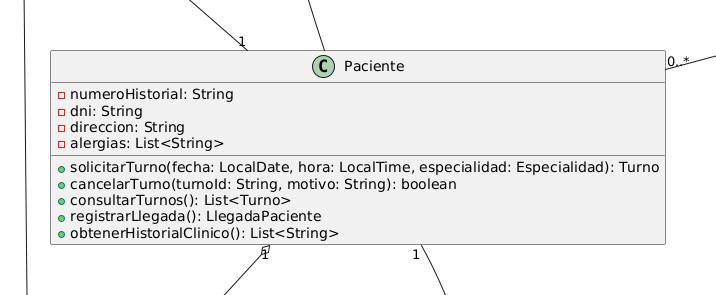
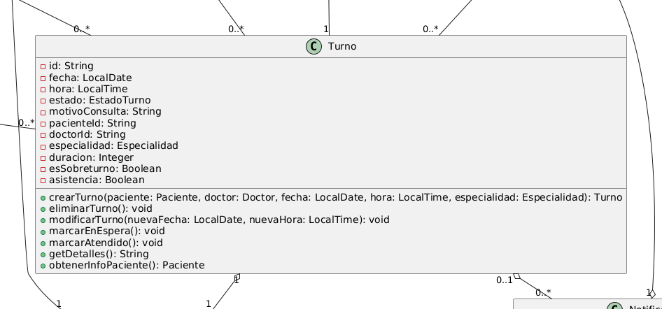
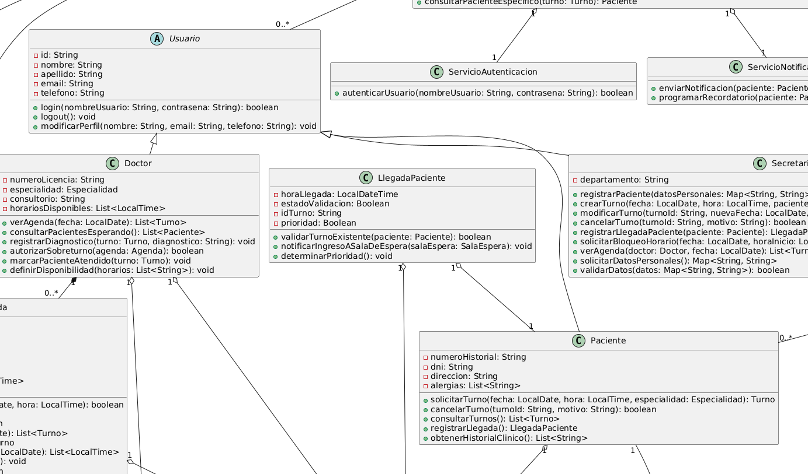
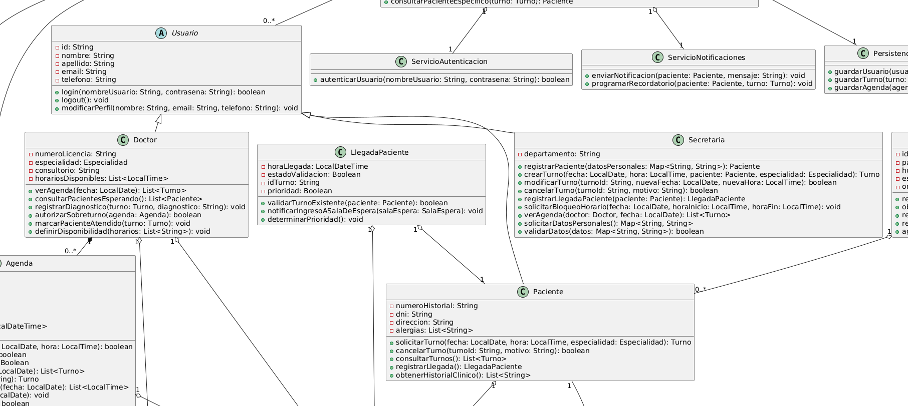
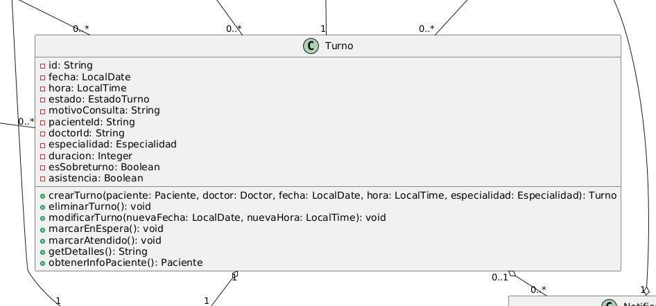

# Los Cuatro Pilares del Paradigma Orientado a Objetos

---

## 1. Encapsulamiento

**Definición:** El encapsulamiento agrupa datos y comportamientos en una unidad y oculta los detalles internos, exponiendo solo una interfaz pública controlada.

**Ejemplo 1 — Paciente:**
La clase `Paciente` oculta atributos sensibles como `- dni: String`, `- direccion: String` y `- alergias: List<String>`. Estos datos no son accesibles directamente desde fuera; las operaciones públicas como `+ solicitarTurno(...)` y `+ cancelarTurno(...)` son las únicas vías previstas para interactuar con el estado del paciente.

**Ejemplo 2 — Turno:**
La clase `Turno` encapsula su ciclo de vida mediante el atributo privado `- estado: EstadoTurno`. El estado solo cambia a través de métodos controlados como `+ eliminarTurno(): void`, `+ marcarEnEspera(): void` y `+ marcarAtendido(): void`, evitando que otras clases modifiquen el estado internamente.

---

## 2. Herencia

**Definición:** La herencia permite que una subclase reutilice y extienda los datos y comportamientos de una clase base, modelando jerarquías de especialización del dominio.

**Ejemplo 1 — Usuario → Paciente:**
La clase abstracta `Usuario` contiene atributos y métodos comunes como `- id`, `- nombre`, `- email`, `- telefono`, `+ login(...)` y `+ logout()`. `Paciente` hereda esta estructura, evitando duplicar la lógica de identidad y autenticación en cada tipo de usuario.

**Ejemplo 2 — Usuario → Doctor:**
`Doctor` también hereda de `Usuario`, reutilizando la identidad y los métodos de sesión. A su vez agrega atributos específicos como `- numeroLicencia` y `- especialidad`, lo que representa correctamente la especialización de un médico dentro del dominio.

---

## 3. Polimorfismo

**Definición:** El polimorfismo permite que diferentes clases respondan a la misma operación o mensaje con comportamientos adecuados a su tipo concreto.

**Ejemplo 1 — `login(...)` declarado en `Usuario` y sobreescribible por `Paciente`, `Doctor` y `Secretaria`:**
La clase abstracta `Usuario` declara `+ login(nombreUsuario: String, contrasena: String): boolean` como interfaz uniforme de acceso al sistema. Cada subclase concreta puede sobreescribir este método con lógica específica a su rol: `Paciente` valida su número de historial clínico, `Doctor` valida su número de licencia médica y `Secretaria` sus credenciales administrativas. El sistema invoca `usuario.login(...)` sin conocer el tipo concreto en tiempo de compilación; el comportamiento correcto se resuelve en tiempo de ejecución según la clase real del objeto.

**Ejemplo 2 — `cancelarTurno(...)` en `Paciente` y `Secretaria`:**
Tanto `Paciente` como `Secretaria` definen el método `+ cancelarTurno(turnoId: String, motivo: String): boolean` con la misma firma. Cuando el sistema necesita cancelar un turno, puede invocar esta operación sobre cualquiera de los dos tipos de usuario y obtener un resultado del mismo tipo, aunque con reglas de negocio distintas: `Paciente` solo puede cancelar sus propios turnos, mientras que `Secretaria` puede cancelar turnos de cualquier paciente. Esta es la esencia del polimorfismo: misma interfaz de operación, comportamiento diferenciado según el tipo concreto en tiempo de ejecución.

---

## 4. Abstracción

**Definición:** La abstracción selecciona los aspectos esenciales de una entidad y oculta los detalles de implementación irrelevantes para el usuario del objeto.

**Ejemplo 1 — Turno:**
`Turno` modela la cita médica con atributos de negocio clave (`fecha`, `hora`, `pacienteId`, `doctorId`, `estado`) e ignora detalles de infraestructura como persistencia o interfaz de usuario. De este modo, expone una representación simple del dominio de citas.

**Ejemplo 2 — Sistema:**
La clase `Sistema` abstrae la orquestación del flujo completo del sistema. Expone métodos como `+ solicitarTurno(...)` y `+ enviarRecordatorioAutomatico(...)` sin revelar cómo se gestiona internamente la autenticación, la persistencia o el envío de notificaciones.

