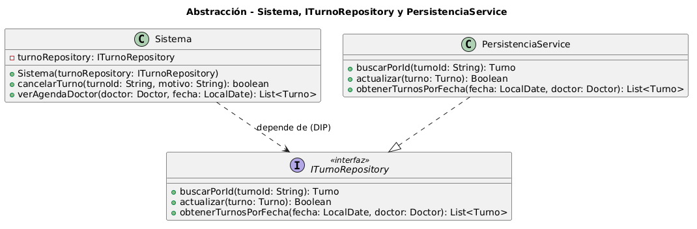

# Abstracción

La abstracción consiste en simplificar la complejidad del mundo real modelando únicamente los aspectos esenciales que son relevantes para el sistema. En el diseño orientado a objetos, esto implica definir **qué debe hacer un objeto** —su interfaz o contrato— sin especificar **cómo lo implementa internamente**. Este pilar permite ocultar los detalles de implementación complejos, centrándose en la representación de entidades del dominio y sus interacciones.

Su importancia radica en tres dimensiones complementarias. Primero, **facilita el diseño y la comprensión**: al ignorar detalles irrelevantes, permite entender el sistema de forma más clara sin necesidad de conocer cada implementación concreta. Segundo, **promueve la extensibilidad**: es posible agregar nuevas implementaciones (por ejemplo, reemplazar un repositorio en archivos por uno en base de datos) sin modificar el código que consume la abstracción. Tercero, **reduce riesgos**: valida el contrato del sistema en etapas tempranas del diseño, antes de comprometerse con una implementación particular.

### Relación con los Principios SOLID

La abstracción es la base sobre la cual se construyen los principios SOLID. El **DIP (Inversión de Dependencias)** es el más estrechamente relacionado: establece que los módulos de alto nivel no deben depender de módulos de bajo nivel, sino que ambos deben depender de abstracciones. El **OCP (Abierto/Cerrado)** se apoya en la abstracción para permitir que el sistema esté abierto a la extensión pero cerrado a la modificación. El **LSP (Sustitución de Liskov)** asegura que las implementaciones concretas sustituyan a sus abstracciones base sin alterar el comportamiento correcto del programa. El **ISP (Segregación de Interfaces)** fomenta la creación de abstracciones específicas y cohesivas para que los clientes no dependan de métodos que no utilizan. El DIP está documentado en detalle en el [Anexo SOLID – DIP](../principios-solid/05-dip.md).

### Relación con los Patrones de Diseño

Los patrones de diseño utilizan la abstracción para resolver problemas recurrentes. Los **patrones creacionales**, como el Factory Method, abstraen el proceso de instanciación de objetos a través de interfaces creadoras (`ITurnoFactory`), lo que está documentado en el [Patrón Factory Method](../patrones-diseno/patron-de-diseno-creacional.md). Los **patrones estructurales**, como Facade, utilizan abstracciones para organizar el acceso a subsistemas complejos, documentado en el [Patrón Facade](../patrones-diseno/patron-de-diseno-estructural.md). Los **patrones de comportamiento**, como Observer, definen una abstracción (`IObserverTurno`) para una familia de comportamientos intercambiables, documentado en el [Patrón Observer](../patrones-diseno/patron-de-diseno-de-comportamiento.md).

## Ejemplo en el proyecto

El caso más representativo de abstracción pura en el sistema es la interfaz `ITurnoRepository`. La clase `Sistema` —módulo de alto nivel— declara como atributo `turnoRepository: ITurnoRepository` y opera exclusivamente sobre ese contrato: invoca `buscarPorId()`, `actualizar()` y `obtenerTurnosPorFecha()` sin conocer en ningún momento que la clase concreta que resuelve esas operaciones es `PersistenciaService`. Este desacoplamiento es exactamente lo que prescribe el DIP.

La interfaz `IPacienteRepository` aplica el mismo principio para la gestión de pacientes (`existePorDni()`, `guardar()`): `Sistema` depende de esa abstracción y no de `PersistenciaService` directamente, aunque en tiempo de ejecución sea la misma clase la que satisfaga ambos contratos. Esto demuestra que una abstracción bien definida permite que una implementación concreta evolucione —o sea reemplazada— sin impacto en los clientes que dependen del contrato.



[Ver diagrama en detalle](./doo-abstraccion.png)

*Diagrama fuente editable:* [doo-abstraccion.puml](./doo-abstraccion.puml)

### Justificación técnica

- `ITurnoRepository` define el contrato (**qué** hace el repositorio) en tres métodos sin revelar ningún detalle de persistencia: sin SQL, sin archivos, sin red ni formato de almacenamiento.
- `PersistenciaService` provee el **cómo** implementando esos métodos. Si el sistema necesita cambiar su mecanismo de persistencia, `Sistema` no requiere ninguna modificación porque depende de la abstracción, no de la implementación.
- La relación `Sistema ..> ITurnoRepository` (dependencia hacia la interfaz) y `PersistenciaService ..|> ITurnoRepository` (realización) modelan en UML el principio DIP: ambas capas dependen de la abstracción, no entre sí.

## Ejemplo de Código

```java
// Sistema declara dependencia de la abstracción, nunca de PersistenciaService directamente
public class Sistema {
    private final ITurnoRepository turnoRepository; // abstracción, no implementación concreta

    // Inyección por constructor: el módulo de alto nivel recibe la abstracción
    public Sistema(ITurnoRepository turnoRepository) {
        this.turnoRepository = turnoRepository;
    }

    public boolean cancelarTurno(String turnoId, String motivo) {
        // Opera sobre la interfaz: qué hace el repositorio, no cómo lo hace internamente
        Turno turno = turnoRepository.buscarPorId(turnoId);
        turno.cancelar(null, motivo);
        return turnoRepository.actualizar(turno); // PersistenciaService resuelve esto en runtime
    }

    public List<Turno> verAgendaDoctor(Doctor doctor, LocalDate fecha) {
        // Sistema desconoce si los datos vienen de una BD, un archivo o una API
        return turnoRepository.obtenerTurnosPorFecha(fecha, doctor);
    }
}

// PersistenciaService provee el "cómo" sin que Sistema lo conozca
public class PersistenciaService implements ITurnoRepository {

    @Override
    public Turno buscarPorId(String turnoId) {
        // Detalle de implementación completamente oculto al cliente
        return baseDeDatos.findById(turnoId);
    }

    @Override
    public Boolean actualizar(Turno turno) {
        return baseDeDatos.update(turno);
    }

    @Override
    public List<Turno> obtenerTurnosPorFecha(LocalDate fecha, Doctor doctor) {
        return baseDeDatos.findByFechaAndDoctor(fecha, doctor);
    }
}
```

La abstracción garantiza que `Sistema` permanezca estable ante cambios de infraestructura: reemplazar `PersistenciaService` por un repositorio en memoria para pruebas, o por uno distribuido en producción, no requiere tocar el código de `Sistema`. En el [Patrón Factory Method](../patrones-diseno/patron-de-diseno-creacional.md), la misma lógica se aplica en la capa de creación: `ITurnoFactory` abstrae el proceso de instanciación con igual criterio.
