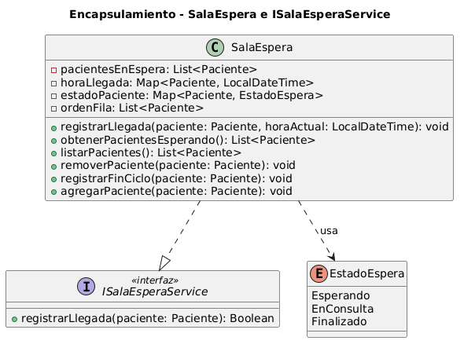

# Encapsulamiento

El encapsulamiento es el proceso de ocultar la implementación interna de un objeto y exponer únicamente sus interfaces públicas. Se describe técnicamente como el empaquetamiento de datos (atributos) y comportamientos (métodos) de manera que el **estado interno del objeto quede protegido**. Es uno de los cuatro pilares fundamentales del paradigma orientado a objetos, permitiendo modelar el software de forma estructurada y modular.

### Problemas que evita

El uso correcto del encapsulamiento previene tres inconvenientes críticos en el desarrollo de software. Primero, los **accesos no autorizados**: impide que agentes externos modifiquen el estado interno de un objeto de manera arbitraria (por ejemplo, alterar directamente la posición de un paciente en la fila de espera sin pasar por los métodos que garantizan la consistencia interna). Segundo, la **fragilidad del sistema**: al cambiar la implementación interna de una clase, el resto del sistema permanece estable porque interactúa a través de interfaces estables, no de detalles internos. Tercero, el **código "espagueti"**: organiza el código de manera lógica y modular, evitando la complejidad excesiva en sistemas grandes.

### Relación con los Modificadores de Acceso

El encapsulamiento se implementa mediante la visibilidad de los miembros en los diagramas de clases y en el código. El símbolo **`-`** (privado) es la regla práctica fundamental para los atributos: indica que solo la propia clase puede acceder a esos datos; en Java se traduce en `private`. El símbolo **`+`** (público) se utiliza para los métodos que el objeto decide exponer para interactuar con otros (getters, setters y métodos de negocio); en Java se traduce en `public`. El símbolo **`#`** (protegido) permite el acceso a la propia clase y a sus clases hijas; en Java se traduce en `protected`.

### Relación con Principios SOLID y Patrones de Diseño

El encapsulamiento es el soporte para la aplicación de conceptos avanzados de diseño. En cuanto a los principios SOLID: el **SRP** facilita módulos cohesivos donde cada clase encapsula una única razón para cambiar, evitando que responsabilidades ajenas contaminen el estado interno; el **OCP** permite que el sistema crezca mediante extensión sin modificar el código ya encapsulado en clases existentes; el **DIP** se apoya en el encapsulamiento para que los módulos dependan de abstracciones y no de los detalles internos de las implementaciones concretas, documentado en el [Anexo SOLID – DIP](../principios-solid/05-dip.md). En cuanto a los patrones: el **Facade** encapsula la complejidad de coordinación de múltiples subsistemas detrás de una interfaz de alto nivel, documentado en el [Patrón Facade](../patrones-diseno/patron-de-diseno-estructural.md); el **Observer** encapsula el comportamiento de reacción ante eventos en cada observador concreto, documentado en el [Patrón Observer](../patrones-diseno/patron-de-diseno-de-comportamiento.md).

## Ejemplo en el proyecto

`SalaEspera` es la clase del sistema con el estado interno más complejo y, a la vez, la interfaz pública más simple. Cuatro estructuras de datos privadas modelan la sala simultáneamente: una lista de pacientes presentes (`-pacientesEnEspera`), un mapa que registra la hora de llegada de cada uno (`-horaLlegada: Map<Paciente, LocalDateTime>`), un mapa que rastrea el estado individual de cada paciente (`-estadoPaciente: Map<Paciente, EstadoEspera>`) y una lista que define el orden de atención (`-ordenFila`). Ninguna de estas estructuras es accesible desde el exterior.

El cliente que interactúa con `SalaEspera` —`Sistema` a través de la interfaz `ISalaEsperaService`— solo conoce el contrato `registrarLlegada(paciente)`: desconoce completamente si internamente la sala usa una lista, una cola de prioridad, o si la hora de llegada se persiste en el mismo mapa o en un servicio externo. Este doble nivel de encapsulamiento es deliberado: `ISalaEsperaService` encapsula el **contrato** (qué operaciones existen) y `SalaEspera` encapsula el **estado** (cómo se organiza la información internamente).



[Ver diagrama en detalle](./doo-encapsulamiento.png)

*Diagrama fuente editable:* [doo-encapsulamiento.puml](./doo-encapsulamiento.puml)

### Justificación técnica

Todos los atributos de `SalaEspera` llevan el modificador `-` (privado). Si el sistema necesitara cambiar el `Map<Paciente, LocalDateTime>` por un sistema de timestamps basado en `Instant`, o reemplazar la lista ordenada `ordenFila` por una `PriorityQueue` con criterios de prioridad médica, ninguna clase cliente debería modificarse: la encapsulación garantiza que los detalles de implementación son una decisión exclusivamente interna de `SalaEspera`. Adicionalmente, `obtenerPacientesEsperando()` debe devolver una copia defensiva de la lista interna (`Collections.unmodifiableList`), impidiendo que el cliente altere el orden de la fila manipulando directamente la referencia devuelta.

## Ejemplo de Código

```java
public class SalaEspera implements ISalaEsperaService {

    // Estado interno complejo: ningún cliente puede acceder directamente a estas estructuras
    private final List<Paciente> pacientesEnEspera = new ArrayList<>();
    private final Map<Paciente, LocalDateTime> horaLlegada = new HashMap<>();
    private final Map<Paciente, EstadoEspera> estadoPaciente = new HashMap<>();
    private final List<Paciente> ordenFila = new ArrayList<>();

    // Único punto de entrada controlado para registrar un paciente en la sala
    @Override
    public boolean registrarLlegada(Paciente paciente) {
        LocalDateTime ahora = LocalDateTime.now();
        pacientesEnEspera.add(paciente);
        horaLlegada.put(paciente, ahora);             // hora encapsulada: el cliente no la gestiona
        estadoPaciente.put(paciente, EstadoEspera.Esperando);
        ordenFila.add(paciente);
        return true;
    }

    // Copia defensiva: el cliente obtiene la lista pero no puede alterar el orden interno
    public List<Paciente> obtenerPacientesEsperando() {
        return Collections.unmodifiableList(ordenFila);
    }

    // Remoción controlada: actualiza consistentemente todas las estructuras internas
    public void removerPaciente(Paciente paciente) {
        pacientesEnEspera.remove(paciente);
        horaLlegada.remove(paciente);      // limpieza consistente garantizada por encapsulamiento
        estadoPaciente.remove(paciente);
        ordenFila.remove(paciente);
    }
}
```

El encapsulamiento garantiza aquí **consistencia entre estructuras**: no es posible que un paciente exista en `horaLlegada` pero no en `estadoPaciente`, porque el único camino para modificar el estado de la sala es a través de los métodos públicos de `SalaEspera`. Cualquier invariante interna —por ejemplo, que un paciente en `ordenFila` siempre tenga una entrada en `estadoPaciente`— es responsabilidad de la propia clase y no puede ser violada desde afuera. En el [Patrón Facade](../patrones-diseno/patron-de-diseno-estructural.md), la clase `Sistema` aplica el mismo principio a nivel arquitectónico: encapsula la coordinación de subsistemas completos detrás de operaciones de alto nivel.
