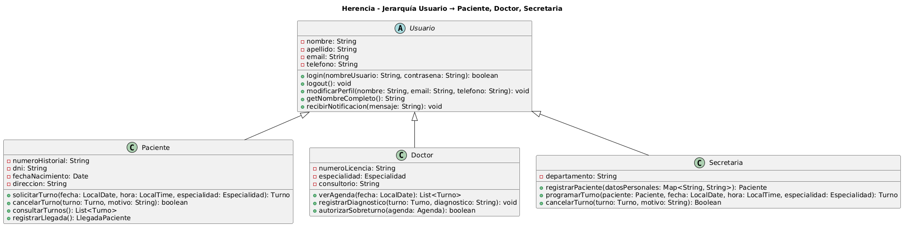

# Herencia

La herencia es un mecanismo fundamental del paradigma orientado a objetos que permite que una clase hija herede propiedades (atributos) y comportamientos (métodos) de una clase padre. Se describe técnicamente como una relación de **"es un"**: un `Paciente` es un `Usuario`, un `Doctor` es un `Usuario`, una `Secretaria` es un `Usuario`. Esto permite crear jerarquías de generalización/especialización donde las clases hijas extienden o redefinen la funcionalidad de la clase base.

> `Usuario` es también una clase abstracta, lo que la vincula al pilar de abstracción; el análisis de este anexo se centra en la relación de herencia y reutilización de código que establece con sus subclases.

### Ventajas y riesgos

Los beneficios principales son dos: **reutilización de código**, evitando la duplicación de lógica común (autenticación, gestión de perfil, notificaciones), y **organización del modelo**, agrupando en la superclase las características compartidas por todos los usuarios del sistema.

Los riesgos son igualmente importantes. Si la jerarquía de herencia crece demasiado, el sistema se vuelve rígido y difícil de mantener. Por eso el diseño orientado a objetos recomienda **preferir la composición sobre la herencia** cuando sea posible, para evitar acoplamientos fuertes y jerarquías profundas. La composición (relación fuerte de "todo-parte") permite que las partes no sobrevivan sin el todo, mientras que la herencia obliga a una relación de tipo que puede ser difícil de cambiar a futuro. En este sistema la jerarquía es de un solo nivel —sin herencia multinivel—, lo que la mantiene controlable y libre de ese riesgo.

### Relación con Principios SOLID

El **LSP (Sustitución de Liskov)** es el principio más vinculado a la herencia: los subtipos deben poder reemplazar a sus tipos base sin alterar el comportamiento correcto del programa. `Paciente`, `Doctor` y `Secretaria` cumplen esta condición: cualquier código que reciba un `Usuario` puede recibir cualquiera de sus subtipos sin consecuencias. El **OCP (Abierto/Cerrado)** se sostiene en la herencia: para agregar un nuevo rol (por ejemplo, `Administrador`) se crea una nueva subclase de `Usuario` sin modificar la superclase ni las clases existentes. El **DIP** se relaciona a través del uso de clases abstractas, que permiten que los módulos de alto nivel dependan de abstracciones en lugar de clases concretas. El LSP está documentado en detalle en el [Anexo SOLID – LSP](../principios-solid/03-lsp.md).

### Relación con Patrones de Diseño

El **Factory Method** utiliza la herencia para que las subclases decidan qué objeto concreto instanciar, documentado en el [Patrón Factory Method](../patrones-diseno/patron-de-diseno-creacional.md). El **Facade** emplea la jerarquía `Usuario` como clientes del sistema: `Secretaria`, `Paciente` y `Doctor` acceden a `Sistema` en sus roles especializados, y la fachada los trata uniformemente a través del tipo base cuando corresponde; documentado en el [Patrón Facade](../patrones-diseno/patron-de-diseno-estructural.md). Los **patrones de comportamiento** como Observer pueden utilizar herencia de una interfaz o clase abstracta común para intercambiar comportamientos dinámicamente entre subtipos.

## Ejemplo en el proyecto

La jerarquía central del sistema es `Usuario → Paciente`, `Usuario → Doctor`, `Usuario → Secretaria`. `Usuario` define en un único lugar los cinco atributos compartidos por todos los actores del sistema (`-id`, `-nombre`, `-apellido`, `-email`, `-telefono`) y los cinco comportamientos comunes (`login()`, `logout()`, `modificarPerfil()`, `getNombreCompleto()`, `recibirNotificacion()`). Las subclases **heredan ese código sin duplicarlo** y agregan únicamente lo que es propio de su rol: `Paciente` suma historial clínico y operaciones de turno; `Doctor` suma número de licencia, especialidad y gestión de agenda; `Secretaria` suma departamento y operaciones administrativas.

La reutilización es directamente cuantificable: los cinco atributos y cinco métodos de `Usuario` no se repiten en ninguna de las tres subclases. Cualquier cambio en `modificarPerfil()` —por ejemplo, agregar validación de formato de email— se aplica una sola vez en `Usuario` y las tres subclases lo heredan automáticamente.



[Ver diagrama en detalle](./doo-herencia.png)

*Diagrama fuente editable:* [doo-herencia.puml](./doo-herencia.puml)

### Justificación técnica

La relación en UML usa la flecha de generalización (`<|--`), que indica una relación de tipo: `Paciente`, `Doctor` y `Secretaria` son subtipos de `Usuario` y satisfacen el LSP. La clase `Sistema` declara `usuarios: List<Usuario>`, lo que confirma en el diseño que el sistema trata a los tres roles de forma uniforme cuando lo necesita, sin requerir conocer el tipo concreto. La especialización de cada subclase se da por **extensión** (agregan atributos y métodos propios) sin **romper el contrato** de la superclase: ninguna subclase redefine `login()` o `recibirNotificacion()` de forma que viole el comportamiento esperado, lo que satisface el LSP.

## Ejemplo de Código

```java
// Superclase: define atributos y comportamiento compartido por todos los usuarios del sistema
public abstract class Usuario {
    private String id;
    private String nombre;
    private String apellido;
    private String email;
    private String telefono;

    // Método heredado por Paciente, Doctor y Secretaria sin duplicación de código
    public boolean login(String nombreUsuario, String contrasena) {
        return ServicioAutenticacion.autenticar(nombreUsuario, contrasena);
    }

    // Una sola implementación de getNombreCompleto disponible para los tres roles
    public String getNombreCompleto() {
        return nombre + " " + apellido;
    }

    // Todos los usuarios reciben notificaciones por el mismo mecanismo heredado
    public void recibirNotificacion(String mensaje) {
        System.out.println("Notificación para " + getNombreCompleto() + ": " + mensaje);
    }

    public void modificarPerfil(String nombre, String email, String telefono) {
        this.nombre = nombre;
        this.email = email;
        this.telefono = telefono;
    }
}

// Subclase Paciente: hereda todo lo de Usuario y agrega especialización de su rol
public class Paciente extends Usuario {
    private String numeroHistorial; // atributo propio, no presente en la superclase
    private String dni;

    // Comportamiento especializado: solo Paciente puede solicitar y cancelar turnos
    public Turno solicitarTurno(LocalDate fecha, LocalTime hora, Especialidad especialidad) {
        System.out.println(getNombreCompleto() + " solicita turno..."); // usa método heredado
        return new Turno(fecha, hora, especialidad);
    }

    public boolean cancelarTurno(Turno turno, String motivo) {
        return turno.cancelar(this, motivo);
    }
}

// Subclase Doctor: hereda comportamiento de Usuario, agrega gestión de agenda médica
public class Doctor extends Usuario {
    private String numeroLicencia; // atributo propio
    private Especialidad especialidad;

    public List<Turno> verAgenda(LocalDate fecha) {
        return agenda.obtenerTurnosDelDia(fecha);
    }

    // Solo Doctor puede autorizar sobreturnos
    public boolean autorizarSobreturno(Agenda agenda) {
        return agenda.validarTurnosContraReglas();
    }
}

// Uso polimórfico de la jerarquía: Sistema almacena todos los roles como Usuario
List<Usuario> usuarios = new ArrayList<>();
usuarios.add(new Paciente(...));    // un Paciente ES UN Usuario (relación "es-un")
usuarios.add(new Doctor(...));      // un Doctor  ES UN Usuario
usuarios.add(new Secretaria(...));  // una Secretaria ES UN Usuario

// Sistema puede iterar sobre todos sin distinguir el tipo concreto
for (Usuario u : usuarios) {
    u.recibirNotificacion("Mantenimiento programado del sistema"); // método heredado en todos
}
```

La jerarquía cumple con el LSP documentado en el [Anexo LSP](../principios-solid/03-lsp.md): cualquier código que opere sobre `Usuario` funciona correctamente con `Paciente`, `Doctor` o `Secretaria`, porque las subclases extienden sin romper las "promesas" de la superclase.
