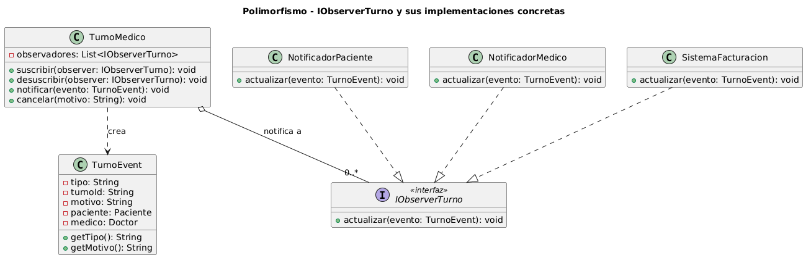

# Polimorfismo

El polimorfismo es la capacidad que tienen los objetos de una misma jerarquía de clases para responder de manera diferente a un mismo mensaje o comando. Técnicamente, significa que un mismo nombre de método puede ejecutar una lógica distinta dependiendo del **tipo real del objeto** que lo recibe en tiempo de ejecución. Esto permite que el sistema tome "muchas formas" y que se pueda escribir código genérico capaz de interactuar con diversos tipos de objetos sin conocer su implementación exacta.

### Tipos de polimorfismo

El material de la cursada distingue dos formas principales. La **redefinición o superposición (override)** ocurre en relaciones de herencia o realización de interfaz, donde una subclase o clase concreta provee su propia implementación de un método ya definido en la superclase o interfaz; en UML, esto se observa cuando el mismo método aparece tanto en la interfaz como en cada clase concreta. La **sobrecarga (overloading)** permite que existan múltiples métodos con el mismo nombre pero distintos parámetros dentro de una misma clase; los diagramas de clases pueden representarla para modelar la estructura estática del sistema.

### Relación con Principios SOLID

El **OCP (Abierto/Cerrado)** es el principio más vinculado al polimorfismo: las entidades deben estar abiertas para su extensión pero cerradas para su modificación. El polimorfismo permite cumplir esto eliminando bloques condicionales (`if/else` o `switch`) basados en tipos de objetos; para agregar un nuevo comportamiento, simplemente se crea una nueva clase que implemente el método polimórfico sin tocar el código existente. El **LSP (Sustitución de Liskov)** se relaciona estrechamente, ya que asegura que cualquier clase concreta que implemente un comportamiento polimórfico pueda sustituir a su abstracción base sin alterar el funcionamiento correcto del sistema. El OCP y el LSP están documentados en los [Anexo SOLID – OCP](../principios-solid/02-ocp.md) y [Anexo SOLID – LSP](../principios-solid/03-lsp.md).

### Relación con Patrones de Diseño

El **patrón Observer** utiliza el polimorfismo para que el sujeto (`TurnoMedico`) notifique a sus observadores sin conocer sus tipos concretos; cada observador reacciona polimórficamente ante el mismo evento. Este patrón está documentado en detalle en el [Patrón Observer](../patrones-diseno/patron-de-diseno-de-comportamiento.md). El **Factory Method** abstrae la creación de objetos permitiendo que las subclases decidan polimórficamente qué clase concreta instanciar, documentado en el [Patrón Factory Method](../patrones-diseno/patron-de-diseno-creacional.md). Los **patrones estructurales** como Facade emplean el polimorfismo para que nuevos componentes se comporten como el tipo original esperado por el sistema, facilitando la integración y extensibilidad.

## Ejemplo en el proyecto

El caso más representativo de polimorfismo de redefinición (override) en el sistema es el método `actualizar(TurnoEvent evento)` de la interfaz `IObserverTurno`. Cuando `TurnoMedico` cancela un turno, construye un `TurnoEvent` con los detalles del cambio e invoca `notificar(evento)`, que itera sobre `List<IObserverTurno>` y llama `observer.actualizar(evento)` sobre cada elemento. El **mismo mensaje** produce tres comportamientos radicalmente distintos según el tipo real del objeto receptor:

- `NotificadorPaciente.actualizar()` resuelve los datos de contacto del paciente, selecciona el canal de comunicación preferido (email, SMS, WhatsApp) y despacha la notificación de cancelación con el motivo incluido.
- `NotificadorMedico.actualizar()` actualiza la agenda interna del médico y puede sincronizar el cambio con plataformas de calendario externas (iCal, Google Calendar).
- `SistemaFacturacion.actualizar()` aplica las políticas de cancelación definidas por el centro médico: puede generar una nota de crédito, marcar la cita como no facturable o registrar el evento para auditoría contable.

`TurnoMedico` no contiene ningún `if (observer instanceof NotificadorPaciente)` ni ningún `switch`: el tipo real del objeto es resuelto en runtime por el mecanismo de **despacho dinámico** de Java, que es la expresión técnica del polimorfismo de redefinición.



[Ver diagrama en detalle](./doo-polimorfismo.png)

*Diagrama fuente editable:* [doo-polimorfismo.puml](./doo-polimorfismo.puml)

### Justificación técnica

`IObserverTurno` declara `actualizar(TurnoEvent): void` como contrato polimórfico. Las tres clases concretas implementan ese método con comportamientos radicalmente distintos y totalmente independientes entre sí. Sin polimorfismo, `TurnoMedico` necesitaría una rama condicional por cada tipo de observador; agregar un cuarto observador (por ejemplo, un `RegistroAuditoria`) requeriría modificar `TurnoMedico`, violando el OCP. Con polimorfismo, basta con crear la nueva clase que implemente `IObserverTurno` y suscribirla: cero cambios en el código existente.

## Ejemplo de Código

```java
// IObserverTurno: contrato polimórfico — mismo nombre de método, implementaciones distintas
public interface IObserverTurno {
    void actualizar(TurnoEvent evento);
}

// NotificadorPaciente: una "forma" del método actualizar
public class NotificadorPaciente implements IObserverTurno {
    @Override
    public void actualizar(TurnoEvent evento) {
        // resuelve canal de contacto del paciente y envía notificación de cancelación
        String canal = resolverCanalPreferido(evento.getPaciente());
        enviarMensaje(canal, "Su turno fue cancelado. Motivo: " + evento.getMotivo());
    }
}

// NotificadorMedico: otra "forma" completamente distinta ante el mismo mensaje
public class NotificadorMedico implements IObserverTurno {
    @Override
    public void actualizar(TurnoEvent evento) {
        // actualiza la agenda del médico y sincroniza con calendario externo
        agenda.eliminarBloque(evento.getTurnoId());
        calendarioExterno.sincronizar(evento.getMedico());
    }
}

// SistemaFacturacion: tercera "forma" con lógica contable independiente
public class SistemaFacturacion implements IObserverTurno {
    @Override
    public void actualizar(TurnoEvent evento) {
        // aplica política de cancelación y genera nota de crédito si corresponde
        if ("CANCELADO".equals(evento.getTipo())) {
            aplicarPoliticaCancelacion(evento.getTurnoId());
        }
    }
}

// TurnoMedico llama al método polimórfico sin conocer los tipos concretos
public class TurnoMedico {
    private List<IObserverTurno> observadores = new ArrayList<>();

    public void cancelar(String motivo) {
        this.estado = EstadoTurno.Cancelado;
        TurnoEvent evento = new TurnoEvent("CANCELADO", this.id, motivo, paciente, medico);
        notificar(evento);
    }

    private void notificar(TurnoEvent evento) {
        // polimorfismo en acción: sin if/else, sin switch, sin instanceof
        for (IObserverTurno observer : observadores) {
            observer.actualizar(evento); // Java resuelve el tipo real en runtime (despacho dinámico)
        }
    }
}
```

El polimorfismo cumple aquí con el OCP documentado en el [Anexo OCP](../principios-solid/02-ocp.md): agregar un `RegistroAuditoria` que implemente `IObserverTurno` y suscribirlo a `TurnoMedico` no modifica una sola línea del código existente. El comportamiento del sistema se extiende añadiendo nuevas "formas" del método `actualizar()`, sin alterar el sujeto que los invoca.
