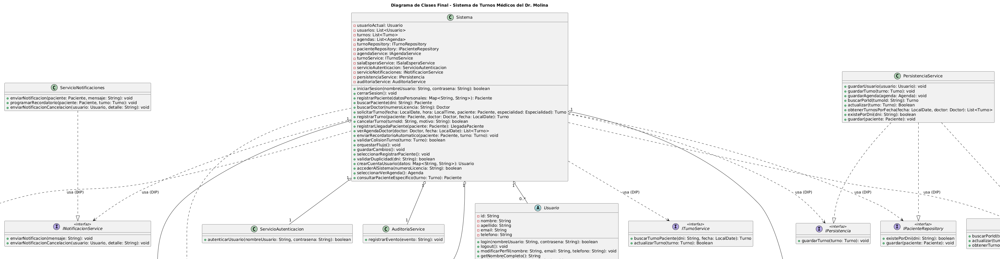

# Abstracción

## Explicación

La abstracción es un principio fundamental de la Programación Orientada a Objetos (POO) que consiste en identificar y modelar únicamente los aspectos esenciales de una entidad para el problema en cuestión, ignorando los detalles de implementación o irrelevantes. En el diseño de software, la abstracción permite definir contratos claros e interfaces para interactuar con los componentes del sistema sin depender de sus detalles concretos.

Este principio se relaciona directamente con los principios SOLID:
- **DIP (Inversión de Dependencias):** Los módulos de alto nivel no dependen de módulos de bajo nivel, sino de abstracciones (interfaces o clases abstractas).
- **ISP (Segregación de Interfaces):** Promueve la creación de interfaces pequeñas y específicas en lugar de interfaces masivas.

Asimismo, se conecta con patrones de diseño como **Strategy**, **Repository** y **Factory Method**, los cuales encapsulan comportamientos o creaciones de objetos detrás de abstracciones o interfaces compartidas.

## Ejemplo en el proyecto



> **Ver detalles del diagrama:** [06-clases-diagrama-final.puml](../../diagramas/01-diagrama-clases/06-clases-diagrama-final.puml)

Se presenta la abstracción del servicio de persistencia, representada por la interfaz `IPersistencia` y su implementación concreta `PersistenciaService`, relacionada de forma acotada con la clase `Sistema`.

### Descripción y Justificación Técnica

El diagrama refleja el principio de abstracción al mostrar que la clase `Sistema` interactúa exclusivamente con el contrato esencial `IPersistencia` para la gestión del almacenamiento de turnos, sin depender ni conocer la implementación concreta (`PersistenciaService`).

Las clases seleccionadas cumplen con este fundamento debido a que se oculta la complejidad técnica de cómo y dónde se persisten los datos (ya sea en memoria, archivo o base de datos). La clase de alto nivel `Sistema` simplemente invoca el método definido en el contrato, reduciendo drásticamente el acoplamiento y permitiendo extender o reemplazar la estrategia de persistencia sin alterar el flujo central del negocio, respetando así el principio DIP.

## Ejemplo de Código

```csharp
public interface IPersistencia
{
    void GuardarTurno(Turno turno);
}

public class PersistenciaService : IPersistencia
{
    public void GuardarTurno(Turno turno)
    {
        // Lógica concreta de almacenamiento
    }
}

public class Sistema
{
    private readonly IPersistencia _persistencia;

    public Sistema(IPersistencia persistencia)
    {
        _persistencia = persistencia;
    }

    public void GuardarCambios()
    {
        _persistencia.GuardarTurno(new Turno());
    }
}

Este fragmento demuestra la implementación de la abstracción al definir el contrato IPersistencia con la operación esencial GuardarTurno. La clase cliente Sistema recibe la abstracción por inyección de dependencias y solo conoce el qué hace el servicio, mientras que PersistenciaService define el cómo. De esta forma, el código oculta los detalles de implementación, disminuye el acoplamiento y facilita la extensibilidad del sistema.