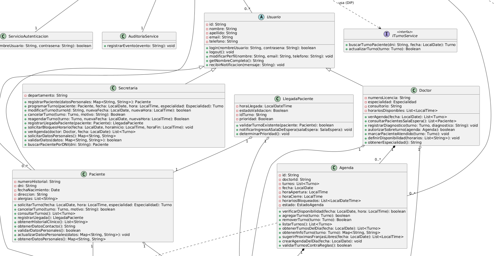

# Herencia

La herencia es un mecanismo fundamental de la Programación Orientada a Objetos (POO) mediante el cual una clase derivada (subclase) adquiere propiedades (atributos) y comportamientos (métodos) de una clase base (superclase), facilitando la reutilización de código y la creación de jerarquías de tipos con una relación de "es un".

Este principio está íntimamente ligado al principio SOLID:
- **LSP (Sustitución de Liskov):** Garantiza que las subclases derivadas puedan reemplazar a su superclase base en cualquier parte del sistema sin alterar la corrección ni el comportamiento esperado del programa.

En términos de arquitectura de software, la herencia sienta las bases para patrones de diseño creacionales y de comportamiento como **Template Method** y **Factory Method**, permitiendo definir esqueletos de comportamiento en la superclase que se especializan en las subclases.

## Ejemplo en el proyecto



> **Ver detalles del diagrama:** [06-clases-diagrama-final.puml](../../diagramas/01-diagrama-clases/06-clases-diagrama-final.puml)

Se presenta la jerarquía de actores del sistema encabezada por la clase abstracta o base `Usuario`, de la cual derivan las subclases especializadas `Paciente`, `Doctor` y `Secretaria`.

El diagrama refleja el principio de herencia mediante el uso del conector de generalización (flecha con triángulo hueco) que apunta desde las subclases hacia la superclase `Usuario`.

Las clases seleccionadas cumplen con este fundamento debido a que `Usuario` abstrae los datos y comportamientos comunes (como `Id`, `Nombre`, `Email`, `Login()`, `Logout()`), evitando duplicación de código en el modelo. Cada subclase agrega atributos y responsabilidades especializadas del dominio (ej. `Dni` e historial en `Paciente`; `NumeroLicencia` y especialidad en `Doctor`; tareas de gestión en `Secretaria`). Esta estructura garantiza la jerarquía tipo "es un" y permite cumplir con el principio LSP.

## Ejemplo de Código

```csharp
public abstract class Usuario
{
    protected string Id { get; set; }
    protected string Nombre { get; set; }
    protected string Email { get; set; }

    public virtual bool Login(string nombreUsuario, string contrasena)
    {
        return !string.IsNullOrWhiteSpace(nombreUsuario) &&
               !string.IsNullOrWhiteSpace(contrasena);
    }

    public void Logout()
    {
        // Lógica común para cerrar sesión
    }
}

public class Paciente : Usuario
{
    public string Dni { get; private set; }

    public override bool Login(string nombreUsuario, string contrasena)
    {
        return base.Login(nombreUsuario, contrasena) &&
               Dni == nombreUsuario;
    }
}

public class Doctor : Usuario
{
    public string NumeroLicencia { get; private set; }
    public string Especialidad { get; private set; }

    public override bool Login(string nombreUsuario, string contrasena)
    {
        return base.Login(nombreUsuario, contrasena) &&
               NumeroLicencia == nombreUsuario;
    }
}

public class Secretaria : Usuario
{
    public string Departamento { get; private set; }

    public override bool Login(string nombreUsuario, string contrasena)
    {
        return base.Login(nombreUsuario, contrasena) &&
               Departamento == "Administración";
    }
}
```

Este fragmento demuestra la herencia al usar la sintaxis : Usuario para derivar Paciente, Doctor y Secretaria. Las subclases reutilizan la estructura base definida en Usuario y especializan la lógica del método Login() mediante la palabra clave override, respetando la firma y la relación de tipo de la superclase.