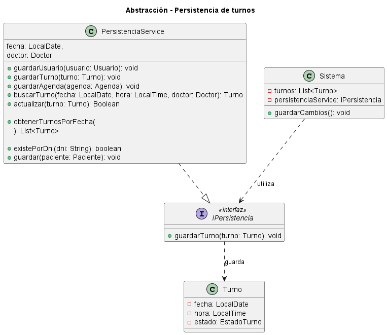

# Abstracción

## Explicación

La abstracción es uno de los fundamentos del Diseño Orientado a Objetos. Consiste en representar únicamente las características y comportamientos esenciales de un elemento, ocultando los detalles internos que no son necesarios para utilizarlo.

En lugar de conocer exactamente cómo se realiza una operación, una clase puede trabajar con un contrato que indique qué operación se encuentra disponible.

En el Diseño Orientado a Objetos, la abstracción puede implementarse mediante:

- interfaces;
- clases abstractas;
- métodos que exponen comportamientos generales;
- separación entre un contrato y su implementación concreta.

Una interfaz define qué operaciones debe ofrecer una clase, pero no necesita especificar todos los detalles de cómo deben realizarse.

Gracias a la abstracción, una clase puede utilizar un servicio sin depender directamente de su implementación interna.

Esto permite:

- reducir el acoplamiento entre clases;
- ocultar detalles técnicos;
- facilitar el reemplazo de implementaciones;
- mejorar la reutilización del código;
- simplificar el mantenimiento del sistema.

## Relación con los principios SOLID y los patrones de diseño

La abstracción se relaciona principalmente con el principio de inversión de dependencias o **Dependency Inversion Principle (DIP)**.

Este principio establece que las clases de alto nivel no deben depender directamente de clases concretas. Tanto las clases de alto nivel como las implementaciones deben depender de abstracciones.

En el proyecto, la clase `Sistema` no depende directamente de `PersistenciaService` para guardar un turno. En su lugar, mantiene una referencia del tipo `IPersistencia`.

De esta manera, `Sistema` conoce la operación `guardarTurno()`, pero no necesita conocer cómo se realiza internamente el almacenamiento.

También se relaciona con el principio de segregación de interfaces o **Interface Segregation Principle (ISP)**, porque una interfaz debe definir solamente las operaciones necesarias para quienes la utilizan.

La abstracción también se encuentra presente en patrones de diseño como:

- Repository;
- Strategy;
- Factory Method;
- Dependency Injection.

En el proyecto se observa una estructura similar al patrón **Repository**, mediante interfaces como `ITurnoRepository` e `IPacienteRepository`, que separan las operaciones de acceso a datos de su implementación concreta.

También se aplica inyección de dependencias conceptualmente, ya que `Sistema` trabaja con referencias a interfaces como `IPersistencia`, `ITurnoRepository`, `IAgendaService`, `ITurnoService`, `ISalaEsperaService` e `INotificacionService`.

---

## Ejemplo en el proyecto

Para representar la abstracción se seleccionaron los siguientes elementos del proyecto:

- `IPersistencia`;
- `PersistenciaService`;
- `Sistema`;
- `Turno`.

La interfaz `IPersistencia` define la operación necesaria para guardar un turno.

La clase `PersistenciaService` implementa esa interfaz y contiene la operación concreta de persistencia.

La clase `Sistema` utiliza una referencia del tipo `IPersistencia`, por lo que puede solicitar el guardado de un turno sin conocer los detalles internos de la implementación.

### Diagrama UML



[Ver el diagrama UML de abstracción en detalle](doo-abstraccion.puml)

### Descripción del diagrama

El diagrama muestra la interfaz `IPersistencia`, que declara la operación pública:

```text
guardarTurno(turno: Turno): void
```

Esta interfaz representa una abstracción porque define qué operación debe estar disponible, pero no muestra cómo se guarda el turno.

La clase `PersistenciaService` implementa `IPersistencia`. La relación de implementación se representa con una línea discontinua y una flecha triangular que apunta hacia la interfaz.

`PersistenciaService` contiene el método `guardarTurno()` y también otras operaciones relacionadas con la persistencia de usuarios, agendas, pacientes y turnos.

La clase `Sistema` mantiene el atributo:

```text
persistenciaService: IPersistencia
```

Esto indica que `Sistema` depende de la interfaz y no directamente de la clase concreta `PersistenciaService`.

El método `guardarCambios()` de `Sistema` puede utilizar la operación definida en `IPersistencia` para solicitar el almacenamiento de un turno.

La interfaz recibe un objeto de tipo `Turno`, que representa la entidad que debe guardarse.

### Justificación técnica

Los elementos seleccionados cumplen con el fundamento de abstracción porque existe una separación entre el contrato y la implementación.

`IPersistencia` representa el contrato. Define que debe ser posible guardar un turno mediante el método `guardarTurno()`, pero no especifica cómo se realiza esa operación.

`PersistenciaService` representa la implementación concreta. Es la clase responsable de desarrollar la lógica necesaria para almacenar el turno.

Por su parte, `Sistema` utiliza la abstracción `IPersistencia`. Por lo tanto, no necesita conocer:

- dónde se almacena el turno;
- qué tecnología de persistencia se utiliza;
- si la información se guarda en una base de datos o en otro medio;
- cuáles son los pasos internos de la operación.

`Sistema` solamente necesita saber que existe una operación llamada `guardarTurno()`.

Esto reduce el acoplamiento, porque la lógica principal del sistema no queda vinculada directamente con una implementación concreta.

Además, si posteriormente se reemplazara `PersistenciaService` por otra clase que también implementara `IPersistencia`, la clase `Sistema` podría continuar utilizando el mismo contrato sin modificar su lógica principal.

---

## Ejemplo de código

El siguiente pseudocódigo representa la implementación de la abstracción mediante la interfaz `IPersistencia`, respetando los elementos definidos en el diagrama del proyecto.

```java
public interface IPersistencia {

    void guardarTurno(Turno turno);
}
```

```java
public class PersistenciaService
    implements IPersistencia {

    @Override
    public void guardarTurno(Turno turno) {
        // Implementación concreta del guardado del turno
    }

    public void guardarUsuario(Usuario usuario) {
        // Implementación concreta del guardado del usuario
    }

    public void guardarAgenda(Agenda agenda) {
        // Implementación concreta del guardado de la agenda
    }
}
```

```java
public class Sistema {

    private List<Turno> turnos;

    private IPersistencia persistenciaService;

    public Sistema(
        IPersistencia persistenciaService
    ) {
        this.persistenciaService =
            persistenciaService;
    }

    public void guardarCambios() {

        for (Turno turno : turnos) {
            persistenciaService
                .guardarTurno(turno);
        }
    }
}
```

### Justificación técnica del código

El código demuestra abstracción porque la clase `Sistema` declara su dependencia utilizando la interfaz `IPersistencia`:

```java
private IPersistencia persistenciaService;
```

Esto significa que `Sistema` no depende directamente de la clase concreta `PersistenciaService`.

El constructor recibe cualquier objeto que cumpla con el contrato definido por `IPersistencia`:

```java
public Sistema(
    IPersistencia persistenciaService
)
```

Cuando `Sistema` necesita guardar un turno, utiliza el método definido por la interfaz:

```java
persistenciaService.guardarTurno(turno);
```

La clase `Sistema` no conoce la implementación interna de ese método. Solo conoce su nombre, el parámetro que recibe y el resultado esperado.

La clase `PersistenciaService` es la encargada de implementar concretamente la operación:

```java
public class PersistenciaService
    implements IPersistencia
```

La palabra `implements` indica que la clase concreta cumple con el contrato definido por la interfaz.

De esta manera, el código separa:

- qué operación debe realizarse, definido por `IPersistencia`;
- cómo se realiza la operación, definido por `PersistenciaService`;
- quién necesita utilizarla, representado por `Sistema`.

Esta separación cumple con el fundamento de abstracción, reduce el acoplamiento y respeta el principio de inversión de dependencias.