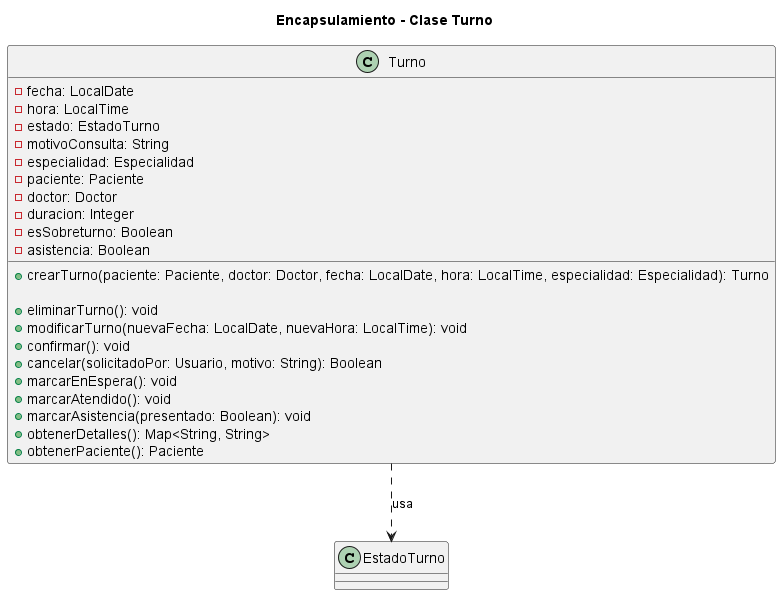

# Encapsulamiento

## Explicación

El encapsulamiento es uno de los fundamentos del Diseño Orientado a Objetos. Consiste en proteger el estado interno de un objeto y permitir que sus datos sean consultados o modificados únicamente mediante las operaciones definidas por la propia clase.

Para aplicar encapsulamiento, los atributos suelen declararse con visibilidad privada, mientras que los métodos que representan comportamientos válidos se exponen públicamente.

De esta manera, otras clases no pueden modificar directamente los datos internos del objeto. Deben utilizar los métodos disponibles, lo que permite controlar cómo se realizan los cambios y mantener la consistencia de la información.

El encapsulamiento es importante porque:

- evita modificaciones arbitrarias sobre los atributos;
- centraliza las reglas relacionadas con el estado del objeto;
- protege la integridad de los datos;
- reduce la dependencia entre las clases;
- facilita el mantenimiento del sistema.

## Relación con los principios SOLID y los patrones de diseño

El encapsulamiento se relaciona principalmente con el principio de responsabilidad única o **Single Responsibility Principle (SRP)**.

Según este principio, una clase debe tener una responsabilidad claramente definida. En este caso, la clase `Turno` es responsable de almacenar y controlar la información correspondiente a un turno médico.

También se relaciona con el principio de abierto/cerrado o **Open/Closed Principle (OCP)**, porque el comportamiento interno de una clase puede modificarse o ampliarse sin que las demás clases tengan que conocer los detalles de su implementación.

Además, el encapsulamiento está presente en patrones como **Facade**, ya que este patrón ofrece operaciones públicas simples y oculta la complejidad interna del sistema. También aparece en patrones como **Repository**, donde se ocultan los detalles relacionados con el almacenamiento y la recuperación de los objetos.

---

## Ejemplo en el proyecto

Para representar el encapsulamiento se seleccionó la clase `Turno` del proyecto **Sistema de Turnos Médicos del Dr. Molina**.

La clase `Turno` contiene la información necesaria para representar un turno médico y dispone de métodos específicos para controlar sus cambios de estado.

### Diagrama UML



[Ver el diagrama UML de encapsulamiento en detalle](doo-encapsulamiento.puml)

### Descripción del diagrama

En el diagrama, los atributos de la clase `Turno` tienen el símbolo `-`, que en UML representa visibilidad privada.

Esto significa que datos como `estado`, `fecha`, `hora`, `asistencia` y `esSobreturno` forman parte del estado interno del objeto y no deben ser modificados directamente desde otras clases.

La clase expone métodos públicos, identificados con el símbolo `+`, para realizar operaciones válidas sobre el turno. Por ejemplo:

- `confirmar()` permite confirmar el turno;
- `cancelar()` permite cancelarlo;
- `marcarEnEspera()` modifica su estado cuando el paciente ingresa a la sala de espera;
- `marcarAtendido()` registra que el turno fue atendido;
- `marcarAsistencia()` permite indicar si el paciente se presentó;
- `modificarTurno()` controla la modificación de su fecha y hora.

El diagrama también muestra que `Turno` utiliza la enumeración `EstadoTurno`, que contiene los diferentes estados posibles del turno.

### Justificación técnica

La clase `Turno` cumple con el fundamento de encapsulamiento porque mantiene sus atributos como privados y permite modificar su estado únicamente mediante métodos públicos definidos por la propia clase.

Por ejemplo, una clase externa no debería cambiar directamente el atributo `estado`. En su lugar, debe utilizar métodos como `confirmar()`, `cancelar()`, `marcarEnEspera()` o `marcarAtendido()`.

Esto permite que la clase controle las modificaciones y aplique las validaciones necesarias antes de alterar su estado interno.

Además, las operaciones relacionadas con un turno quedan concentradas dentro de `Turno`. Así se evita que las reglas de negocio estén distribuidas entre distintas partes del sistema.

---

## Ejemplo de código

El siguiente pseudocódigo representa la aplicación del encapsulamiento en la clase `Turno`, respetando los atributos y métodos definidos en el diagrama del proyecto.

```java
public class Turno {

    private LocalDate fecha;
    private LocalTime hora;
    private EstadoTurno estado;
    private String motivoConsulta;
    private Especialidad especialidad;
    private Paciente paciente;
    private Doctor doctor;
    private Integer duracion;
    private Boolean esSobreturno;
    private Boolean asistencia;

    public void confirmar() {
        this.estado = EstadoTurno.Reservado;
    }

    public Boolean cancelar(
        Usuario solicitadoPor,
        String motivo
    ) {
        if (solicitadoPor == null || motivo == null || motivo.isEmpty()) {
            return false;
        }

        this.estado = EstadoTurno.Cancelado;
        this.motivoConsulta = motivo;

        return true;
    }

    public void marcarEnEspera() {
        this.estado = EstadoTurno.EnEspera;
    }

    public void marcarAtendido() {
        this.estado = EstadoTurno.Atendido;
    }

    public void marcarAsistencia(Boolean presentado) {
        this.asistencia = presentado;

        if (!presentado) {
            this.estado = EstadoTurno.Ausente;
        }
    }

    public void modificarTurno(
        LocalDate nuevaFecha,
        LocalTime nuevaHora
    ) {
        this.fecha = nuevaFecha;
        this.hora = nuevaHora;
    }
}
```

### Justificación técnica del código

El fragmento demuestra encapsulamiento porque todos los atributos de `Turno` fueron declarados como privados mediante la palabra `private`.

Por ese motivo, otras clases no pueden realizar una modificación directa como la siguiente:

```java
turno.estado = EstadoTurno.Cancelado;
```

En cambio, deben solicitar el cambio mediante un método público:

```java
turno.cancelar(usuario, "El paciente no puede asistir");
```

El método `cancelar()` recibe la información necesaria, realiza una validación y, solamente si los datos son correctos, modifica el estado interno del objeto.

Lo mismo ocurre con los métodos `confirmar()`, `marcarEnEspera()`, `marcarAtendido()` y `marcarAsistencia()`. Cada uno representa una operación válida sobre el turno y controla internamente la modificación correspondiente.

De esta manera, la clase `Turno` protege su información, concentra las reglas relacionadas con sus cambios de estado y evita que otras partes del sistema modifiquen sus atributos de manera arbitraria.
