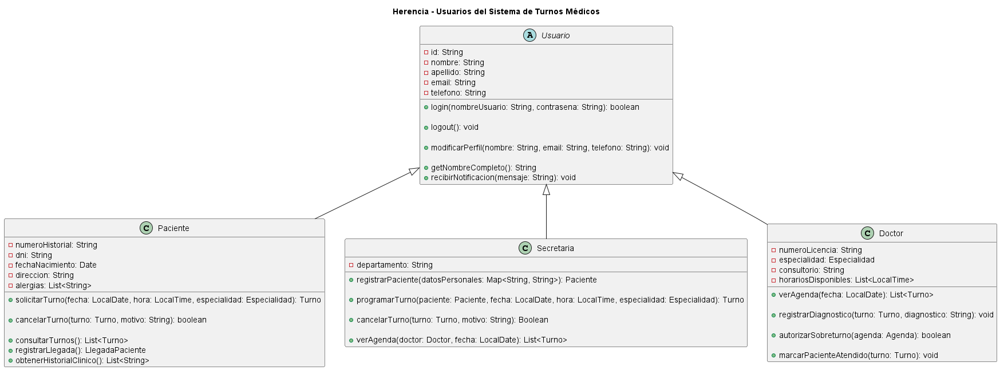

# Herencia

## Explicación

La herencia es uno de los fundamentos del Diseño Orientado a Objetos. Permite crear una clase nueva a partir de otra clase existente, reutilizando sus atributos y comportamientos comunes.

La clase que contiene las características generales se denomina **clase padre**, **superclase** o **clase base**. Las clases que reciben esas características se denominan **clases hijas**, **subclases** o **clases derivadas**.

Una subclase puede:

- reutilizar los atributos de la clase padre;
- utilizar los métodos heredados;
- agregar atributos y comportamientos específicos;
- redefinir determinados comportamientos cuando sea necesario.

La herencia resulta útil cuando varias clases representan tipos diferentes de una misma entidad general. De esta manera, se evita repetir atributos y métodos comunes en cada clase.

## Relación con los principios SOLID y los patrones de diseño

La herencia se relaciona especialmente con el principio de sustitución de Liskov o **Liskov Substitution Principle (LSP)**.

Este principio establece que los objetos de una clase hija deben poder utilizarse en los lugares donde se espera un objeto de la clase padre, sin alterar el comportamiento correcto del sistema.

En el proyecto, `Paciente`, `Secretaria` y `Doctor` son tipos específicos de `Usuario`. Por lo tanto, el sistema puede tratar a cualquiera de ellos como un `Usuario` cuando necesita utilizar comportamientos generales, como iniciar sesión, cerrar sesión, modificar el perfil o recibir una notificación.

La herencia también se relaciona con el principio de abierto/cerrado o **Open/Closed Principle (OCP)**. Es posible incorporar nuevos tipos de usuarios extendiendo la clase `Usuario`, sin tener que modificar las clases existentes.

Además, la herencia puede utilizarse en patrones como **Template Method**, donde una clase base define una estructura general y las clases derivadas completan o especializan determinados pasos.

En el proyecto no se observa una implementación explícita del patrón Template Method. Sin embargo, la estructura jerárquica de `Usuario` y sus subclases permitiría aplicar este tipo de patrón si fuera necesario.

---

## Ejemplo en el proyecto

Para representar la herencia se seleccionaron las siguientes clases del proyecto:

- `Usuario`
- `Paciente`
- `Secretaria`
- `Doctor`

`Usuario` es una clase abstracta que reúne los datos y comportamientos compartidos por los distintos tipos de usuarios del sistema.

Las clases `Paciente`, `Secretaria` y `Doctor` heredan de `Usuario` y agregan atributos y operaciones propios de cada rol.

### Diagrama UML



[Ver el diagrama UML de herencia en detalle](doo-herencia.puml)

### Descripción del diagrama

El diagrama presenta a `Usuario` como una clase abstracta. En UML esto se representa mediante la palabra `abstract`.

La clase contiene los atributos compartidos por los usuarios del sistema:

- `id`
- `nombre`
- `apellido`
- `email`
- `telefono`

También incluye comportamientos generales:

- `login()`
- `logout()`
- `modificarPerfil()`
- `getNombreCompleto()`
- `recibirNotificacion()`

Las flechas de generalización apuntan desde `Paciente`, `Secretaria` y `Doctor` hacia `Usuario`. Esto indica que las tres clases heredan de la clase abstracta.

Cada clase hija incorpora información y comportamientos propios de su función dentro del sistema.

`Paciente` agrega datos como el número de historial, el DNI, la fecha de nacimiento, la dirección y las alergias. También incorpora operaciones relacionadas con la solicitud y cancelación de turnos.

`Secretaria` agrega el departamento y las operaciones necesarias para registrar pacientes, programar turnos, modificar turnos y consultar agendas.

`Doctor` agrega el número de licencia, la especialidad, el consultorio y sus horarios disponibles. También incorpora operaciones para consultar la agenda, registrar diagnósticos y marcar pacientes como atendidos.

### Justificación técnica

Las clases seleccionadas cumplen con el fundamento de herencia porque `Paciente`, `Secretaria` y `Doctor` representan tipos específicos de `Usuario`.

Los tres roles comparten información básica, como el nombre, apellido, correo electrónico y teléfono. También comparten comportamientos relacionados con el acceso al sistema y la administración del perfil.

En lugar de repetir esos atributos y métodos en cada una de las tres clases, se los concentra en la clase abstracta `Usuario`.

Las clases derivadas heredan las características comunes y agregan únicamente los elementos específicos de cada rol.

Esto permite:

- reducir la duplicación de código;
- representar claramente la relación “es un”;
- centralizar los datos compartidos;
- facilitar la incorporación de nuevos tipos de usuarios;
- tratar a los distintos roles mediante el tipo general `Usuario`.

La relación puede expresarse de la siguiente manera:

- un `Paciente` es un `Usuario`;
- una `Secretaria` es un `Usuario`;
- un `Doctor` es un `Usuario`.

---

## Ejemplo de código

El siguiente pseudocódigo representa la jerarquía de clases definida en el diagrama del proyecto.

```java
public abstract class Usuario {

    private String id;
    private String nombre;
    private String apellido;
    private String email;
    private String telefono;

    public boolean login(
        String nombreUsuario,
        String contrasena
    ) {
        // Validación general para el ingreso al sistema
        return true;
    }

    public void logout() {
        // Finalización de la sesión
    }

    public void modificarPerfil(
        String nombre,
        String email,
        String telefono
    ) {
        this.nombre = nombre;
        this.email = email;
        this.telefono = telefono;
    }

    public String getNombreCompleto() {
        return nombre + " " + apellido;
    }

    public void recibirNotificacion(String mensaje) {
        // Recepción de la notificación
    }
}
```

```java
public class Paciente extends Usuario {

    private String numeroHistorial;
    private String dni;
    private Date fechaNacimiento;
    private String direccion;
    private List<String> alergias;

    public Turno solicitarTurno(
        LocalDate fecha,
        LocalTime hora,
        Especialidad especialidad
    ) {
        // Solicitud de un turno médico
        return new Turno();
    }

    public List<Turno> consultarTurnos() {
        // Consulta de los turnos del paciente
        return new ArrayList<>();
    }
}
```

```java
public class Secretaria extends Usuario {

    private String departamento;

    public Paciente registrarPaciente(
        Map<String, String> datosPersonales
    ) {
        // Registro de un nuevo paciente
        return new Paciente();
    }

    public List<Turno> verAgenda(
        Doctor doctor,
        LocalDate fecha
    ) {
        // Consulta de la agenda del doctor
        return new ArrayList<>();
    }
}
```

```java
public class Doctor extends Usuario {

    private String numeroLicencia;
    private Especialidad especialidad;
    private String consultorio;
    private List<LocalTime> horariosDisponibles;

    public List<Turno> verAgenda(LocalDate fecha) {
        // Consulta de la agenda del día
        return new ArrayList<>();
    }

    public void registrarDiagnostico(
        Turno turno,
        String diagnostico
    ) {
        // Registro del diagnóstico correspondiente
    }
}
```

### Justificación técnica del código

El código demuestra herencia mediante la palabra `extends`.

```java
public class Paciente extends Usuario
```

```java
public class Secretaria extends Usuario
```

```java
public class Doctor extends Usuario
```

Esto significa que las tres clases reciben los atributos y métodos definidos en `Usuario`.

Por ejemplo, un objeto de tipo `Doctor` puede utilizar el método heredado `getNombreCompleto()` sin tener que declararlo nuevamente dentro de la clase `Doctor`.

```java
Doctor doctor = new Doctor();

doctor.login("doctor01", "clave");
doctor.getNombreCompleto();
doctor.recibirNotificacion("Tiene un nuevo turno asignado");
doctor.verAgenda(fecha);
```

En este caso, `login()`, `getNombreCompleto()` y `recibirNotificacion()` provienen de `Usuario`, mientras que `verAgenda()` corresponde al comportamiento específico de `Doctor`.

La implementación evita repetir las características comunes en cada clase y permite que cada subclase conserve únicamente sus responsabilidades particulares.

También se respeta la relación de generalización definida en el diagrama: `Paciente`, `Secretaria` y `Doctor` pueden ser tratados como objetos de tipo `Usuario`.

```java
List<Usuario> usuarios = new ArrayList<>();

usuarios.add(new Paciente());
usuarios.add(new Secretaria());
usuarios.add(new Doctor());
```

La colección puede almacenar objetos de las tres clases porque todas heredan de `Usuario`. Esto demuestra la reutilización y la organización jerárquica proporcionadas por la herencia.