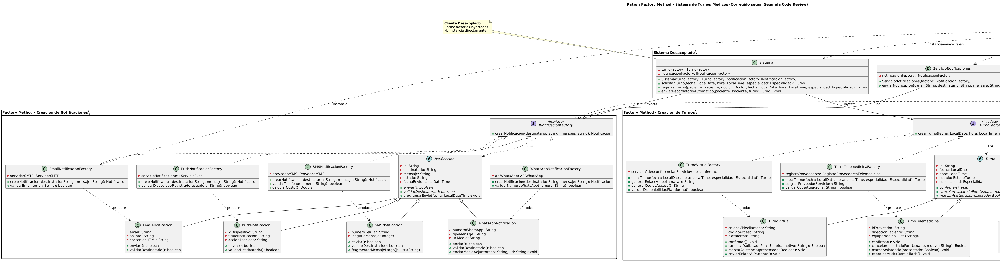

# Documento Explicativo: Patrón de Diseño Creacional

## 1. Introducción a Patrones Creacionales y su Relación con SOLID

Los patrones creacionales encapsulan los mecanismos de instanciación del sistema, abstrayendo cómo se crean, componen y representan los objetos de dominio. Su aplicación directa mitiga los problemas derivados del acoplamiento rígido introducido por el operador `new`. En este escenario, el patrón **Factory Method** impacta de forma directa sobre el ecosistema completo de los principios SOLID:

* **Single Responsibility Principle (SRP):** En el diseño original, clases controladoras como `Sistema` y `Secretaria` asumían una doble responsabilidad: resolver la lógica de negocio y gestionar el ciclo de vida y la configuración de infraestructura de los objetos del dominio (`Turno` y `Notificacion`). Al delegar la creación a fábricas dedicadas, las clases del negocio retienen una única responsabilidad operacional.
* **Open/Closed Principle (OCP):** Permite extender el sistema agregando nuevos subtipos de productos (por ejemplo, un nuevo canal de alertas o una nueva modalidad de turnos) mediante la simple incorporación de una fábrica concreta adicional, eliminando la necesidad de modificar el código existente en las controladoras centrales.
* **Liskov Substitution Principle (LSP):** El patrón establece como precondición estructural que todos los productos concretos (`TurnoPresencial`, `TurnoVirtual`) hereden de manera estricta del tipo abstracto común (`Turno`). Esto garantiza que los clientes consuman las instancias polimórficamente de forma transparente, asegurando que cualquier subclase sea un sustituto válido del tipo base sin romper el comportamiento esperado.
* **Interface Segregation Principle (ISP):** Se evitó conscientemente la creación de una interfaz de fábrica unificada o sobrecargada. En su lugar, se segregaron los contratos en dos abstracciones independientes (`ITurnoFactory` e `INotificacionFactory`). De este modo, los clientes como la clase `Secretaria` solo dependen de la interfaz de creación que realmente necesitan utilizar (`ITurnoFactory`), manteniéndose desacoplados de lógicas ajenas a su contexto.
* **Dependency Inversion Principle (DIP):** Las clases de alto nivel (`Sistema`) ya no dependen de módulos concretos e infraestructurales de bajo nivel. Mediante la inyección por constructor de las interfaces creadoras, tanto los clientes como los componentes de creación dependen exclusivamente de abstracciones estables.

## 2. Propósito y Tipo del Patrón Seleccionado
- **Patrón Seleccionado:** Factory Method (Método de Fábrica).
- **Tipo:** Creacional de Objetos.
- **Propósito:** Define una interfaz para crear un objeto, pero deja que las subclases decidan qué clase instanciar. Permite que una clase delegue la responsabilidad de la instanciación a sus subclases, abstrayendo por completo el proceso del cliente central.

## 3. Motivación Detallada del Problema y la Solución
### El Problema en el Sistema de Turnos Médicos
Originalmente, clases arquitectónicas centrales como `Sistema` y `Secretaria` se encontraban fuertemente acopladas a la clase concreta `Turno` a través de la instanciación directa (`new Turno(...)`). Del mismo modo, el envío de alertas compartía un acoplamiento monolítico dentro de `ServicioNotificaciones`. 

Esta estructura generaba una violación crítica al principio **OCP**, dado que la incorporación de nuevos canales de atención (como `TurnoVirtual` o `TurnoTelemedicina`) o nuevos canales de mensajería (`WhatsAppNotificacion`, `PushNotificacion`) requería la intervención directa y modificación del código fuente de las controladoras lógicas existentes, aumentando el riesgo de efectos colaterales y rigidez en el mantenimiento.

### La Solución Implementada
Se introdujeron dos estructuras de fábricas basadas en Factory Method:
1. **Subsistema de Turnos:** Se definió la interfaz creadora `ITurnoFactory` con el método abstracto `crearTurno()`. Clases como `TurnoPresencialFactory` o `TurnoVirtualFactory` implementan esta interfaz y se encargan de configurar los atributos específicos de cada variante de turno (ej. enlaces de videoconferencia o asignación física de consultorios), devolviendo una abstracción de tipo `Turno`.
2. **Subsistema de Notificaciones:** Se estructuró bajo la interfaz `INotificacionFactory`, aislando las responsabilidades de validación de canales independientes (servidores SMTP, APIs de mensajería o tokens de dispositivos push).

Las clases `Sistema`, `Secretaria` y `ServicioNotificaciones` ahora reciben estas fábricas mediante **Inyección de Dependencias por Constructor**, eliminando por completo el uso del operador `new` en sus capas de servicio.

## 4. Estructura de Clases
A continuación, se detalla el modelado UML de la solución implementada donde se visualiza el desacoplamiento de las fábricas y sus respectivos productos:

*El diagrama interactivo original y su sintaxis editable pueden comprobarse en el siguiente enlace:* [Archivo fuente PlantUML (06-patron-creacional-factory.puml)](../../diagramas/01-diagrama-clases/06-patron-creacional-factory.puml)

### 4.1. Análisis Técnico de Participantes GoF Mapeados al Sistema

#### Jerarquía del Sistema de Turnos
* **Creator (`ITurnoFactory`):** Declarada como interfaz pública en lugar de clase abstracta debido a que no requiere heredar comportamiento ni estado común. Define el contrato puro operacional para la fabricación desacoplada de objetos del dominio.
* **ConcreteCreator (`TurnoPresencialFactory`):** Encapsula y aísla la lógica de infraestructura física del sanatorio. Mantiene una asociación con la entidad corporativa `AgendaConsultorios` para verificar y reservar la disponibilidad de espacios físicos y asignar el identificador de consultorio correspondiente antes de la instanciación física del producto.
* **ConcreteCreator (`TurnoVirtualFactory`):** Maneja la inicialización remota estándar y genérica. Se diferencia de la de telemedicina en que está diseñada para integraciones externas asincrónicas comunes (como enlaces de plataformas web).
* **ConcreteCreator (`TurnoTelemedicinaFactory`):** Resuelve la problemática específica de la atención clínica integrada de alta complejidad médica. Implementa de manera nativa la interacción y autenticación segura con la API del proveedor de salud para generar la credencial de la plataforma médica exigida por la regulación del sanatorio.
* **Product (`Turno`):** Diseñado como clase abstracta en lugar de interfaz pura porque aloja atributos estructurales del dominio compartidos por todos los tipos de turnos (`fecha`, `hora`, `especialidad`) y define las firmas polimórficas de los métodos abstractos `confirmar()`, `cancelar()` y `marcarAsistencia()`.
* **ConcreteProducts (`TurnoPresencial`, `TurnoVirtual`, `TurnoTelemedicina`):** Especializaciones del dominio que incorporan sus propios atributos de estado complementarios y específicos (`numeroConsultorio`/`pisoEdificio`, `enlaceVideollamada`/`codigoAcceso`/`plataforma`, y `idProveedor`/`direccionPaciente`/`equipoMedico` respectivamente) para ejecutar sus comportamientos polimórficos de atención al paciente.

#### Jerarquía del Sistema de Notificaciones
* **Creator (`INotificacionFactory`):** Interfaz que define el contrato abstracto de instanciación para los canales de comunicación de alertas de la clínica.
* **ConcreteCreators (`Email- / SMS- / WhatsApp- / PushNotificacionFactory`):** Componentes técnicos aislados encargados de resolver la configuración inicial, credenciales de pasarelas, protocolos y parámetros de red específicos de cada canal proveedor (SMTP, Twilio, Firebase, etc.).
* **Product (`Notificacion`):** Clase abstracta que define la interfaz común de comunicación externa a través del método abstracto `enviar(mensaje: String)`.
* **ConcreteProducts (`EmailNotificacion`, `SMSNotificacion`, `WhatsAppNotificacion`, `PushNotificacion`):** Implementaciones de bajo nivel que encapsulan los detalles del driver o librería encargada de la transmisión efectiva del mensaje según el medio físico seleccionado.

## 5. Justificación Técnica de la Solución Propuesta
La solución optimiza la creación de objetos en el sistema debido a:
- **Reducción del Acoplamiento:** Las clases clientes interaccionan puramente con `ITurnoFactory` e `INotificacionFactory`. Desconocen qué subtipo de objeto se está instanciando en tiempo de ejecución.
- **Facilidad de Extensibilidad:** Si el centro médico requiere incorporar un "Turno de Emergencia" o notificaciones por un nuevo canal, solo se deberá crear una nueva clase fábrica y su respectivo producto concreto, sin alterar una sola línea de código de las clases `Sistema` o `Secretaria`.
- **Cumplimiento de SRP (Single Responsibility Principle):** La lógica de inicialización y validación de infraestructura de cada tipo de turno y mensajería se ha movido fuera de las controladoras del negocio, centralizándose en sus respectivas fábricas dedicadas.

## 6. Justificación del Patrón frente a Alternativas del Catálogo GoF

Para validar de forma concluyente el diseño seleccionado, se evaluó formalmente la exclusión de otros patrones creacionales competidores:

### 6.1. Distinción frente a Abstract Factory
Aunque la solución implementa dos jerarquías de fábricas paralelas (`ITurnoFactory` e `INotificacionFactory`), se descartó la unificación en un único Abstract Factory debido a que **los turnos y las notificaciones constituyen dominios y familias de productos independientes**. No existe una coordinación restrictiva o una relación de coexistencia obligatoria entre ellos: un `TurnoVirtual` puede ser perfectamente alertado a través de Email, SMS o WhatsApp de forma dinámica. Forzar un Abstract Factory unificado habría acoplado artificialmente ambas familias e introducido restricciones de compatibilidad inexistentes en las reglas de negocio, violando el principio ISP.

### 6.2. Descarte de Builder
El patrón Builder está diseñado para la construcción paso a paso de objetos complejos que poseen configuraciones altamente variables, componentes opcionales o un algoritmo de ensamble multifase. En nuestro sistema de gestión, la construcción de una instancia de `Turno` o `Notificacion` se ejecuta de manera atómica, requiriendo parámetros iniciales estables y bien definidos (`fecha`, `hora`, `especialidad`). El uso de Factory Method es suficiente y óptimo, evitando sobrecargar el diseño con APIs fluidas o directores complejos innecesarios.

### 6.3. Descarte de Prototype
El patrón Prototype se justifica cuando el costo computacional de instanciación de un nuevo objeto es elevado, o cuando el sistema requiere clonar ejemplares pre-configurados que funcionan como plantillas. En el modelo de la clínica, cada instancia de `Turno` generada posee atributos transaccionales únicos y variables que responden estrictamente al momento de la solicitud (combinaciones específicas de paciente, doctor, fecha y hora). Al no existir un escenario de duplicación de estados basados en prototipos genéricos, Prototype es inaplicable y carece de viabilidad técnica.