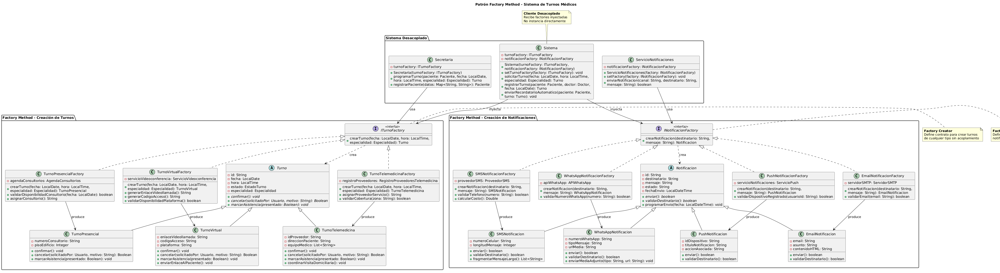

# Documento Explicativo: Patrón de Diseño Creacional

## 1. Introducción a los Patrones Creacionales y su relación con SOLID
Los patrones de diseño creacionales abstraen el proceso de instanciación de objetos. Ayudan a que un sistema sea independiente de cómo se crean, componen y representan sus objetos, encapsulando el conocimiento sobre qué clases concretas utiliza el sistema.

Esta categoría de patrones está íntimamente ligada a los principios SOLID:
- **Open/Closed Principle (OCP):** Permiten introducir nuevos tipos de objetos al sistema sin necesidad de modificar las clases controladoras o clientes existentes, ya que el comportamiento de creación se extiende mediante nuevas fábricas o métodos derivados.
- **Dependency Inversion Principle (DIP):** Los clientes dejan de depender de clases concretas (instanciadas mediante el operador `new`) y pasan a depender de abstracciones (interfaces o clases abstractas tanto para los productos como para los creadores).

## 2. Propósito y Tipo del Patrón Seleccionado
- **Patrón Seleccionado:** Factory Method (Método de Fábrica).
- **Tipo:** Creacional de Objetos.
- **Propósito:** Define una interfaz para crear un objeto, pero deja que las subclases decidan qué clase instanciar. Permite que una clase delegue la responsabilidad de la instanciación a sus subclases, abstrayendo por completo el proceso del cliente central.

## 3. Motivación Detallada del Problema y la Solución
### El Problema en el Sistema de Turnos Médicos
Originalmente, clases arquitectónicas centrales como `Sistema` y `Secretaria` se encontraban fuertemente acopladas a la clase concreta `Turno` a través de la instanciación directa (`new Turno(...)`). Del mismo modo, el envío de alertas compartía un acoplamiento monolítico dentro de `ServicioNotificaciones`. 

Esta estructura generaba una violación crítica al principio **OCP**, dado que la incorporación de nuevos canales de atención (como `TurnoVirtual` o `TurnoTelemedicina`) o nuevos canales de mensajería (`WhatsAppNotificacion`, `PushNotificacion`) requería la intervención directa y modificación del código fuente de las controladoras lógicas existentes, aumentando el riesgo de efectos colaterales y rigidez en el mantenimiento.

### La Solución Implementada
Se introdujeron dos estructuras de fábricas basadas en Factory Method:
1. **Subsistema de Turnos:** Se definió la interfaz creadora `ITurnoFactory` con el método abstracto `crearTurno()`. Clases como `TurnoPresencialFactory` o `TurnoVirtualFactory` implementan esta interfaz y se encargan de configurar los atributos específicos de cada variante de turno (ej. enlaces de videoconferencia o asignación física de consultorios), devolviendo una abstracción de tipo `Turno`.
2. **Subsistema de Notificaciones:** Se estructuró bajo la interfaz `INotificacionFactory`, aislando las responsabilidades de validación de canales independientes (servidores SMTP, APIs de mensajería o tokens de dispositivos push).

Las clases `Sistema`, `Secretaria` y `ServicioNotificaciones` ahora reciben estas fábricas mediante **Inyección de Dependencias por Constructor**, eliminando por completo el uso del operador `new` en sus capas de servicio.

## 4. Estructura de Clases
A continuación, se detalla el modelado UML de la solución implementada donde se visualiza el desacoplamiento de las fábricas y sus respectivos productos:

*El diagrama interactivo original y su sintaxis editable pueden comprobarse en el siguiente enlace:* [Archivo fuente PlantUML (01-patron-creacional-factory.puml)](../../diagramas/01-diagrama-clases/01-patron-creacional-factory.puml)

## 5. Justificación Técnica de la Solución Propuesta
La solución optimiza la creación de objetos en el sistema debido a:
- **Reducción del Acoplamiento:** Las clases clientes interaccionan puramente con `ITurnoFactory` e `INotificacionFactory`. Desconocen qué subtipo de objeto se está instanciando en tiempo de ejecución.
- **Facilidad de Extensibilidad:** Si el centro médico requiere incorporar un "Turno de Emergencia" o notificaciones por un nuevo canal, solo se deberá crear una nueva clase fábrica y su respectivo producto concreto, sin alterar una sola línea de código de las clases `Sistema` o `Secretaria`.
- **Cumplimiento de SRP (Single Responsibility Principle):** La lógica de inicialización y validación de infraestructura de cada tipo de turno y mensajería se ha movido fuera de las controladoras del negocio, centralizándose en sus respectivas fábricas dedicadas.