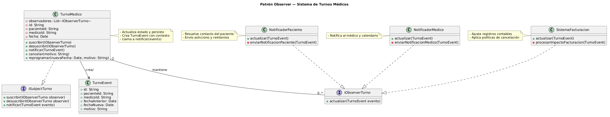

# Anexo – Aplicación de Patrón de Diseño de Comportamiento – Observer

### Patrones de Diseño de Comportamiento y su relación con SOLID
Los patrones de diseño de comportamiento se centran en la comunicación y colaboración entre objetos —cómo interactúan, se notifican y delegan responsabilidades— para resolver problemas recurrentes de diseño. Estos patrones promueven principios SOLID al favorecer la separación de responsabilidades y la extensibilidad:

- Responsabilidad Única (SRP): Cada objeto tiene una única razón para cambiar; por ejemplo, un notificador se encarga sólo de notificar.
- Abierto/Cerrado (OCP): Los componentes pueden extenderse (añadiendo nuevos observadores) sin modificar la lógica del sujeto que publica eventos.

### Propósito y Tipo del Patrón
**Propósito:** El objetivo es notificar automáticamente al paciente, al médico y al sistema de facturación cuando un turno es cancelado o reprogramado, evitando el acoplamiento fuerte entre `TurnoMedico` y los módulos de notificación y facturación. De este modo, la lógica de gestión de turnos permanece separada de las responsabilidades de notificación y cobro.

**Tipo:** Patrón de Comportamiento — Observer.

### Motivación
Antes de aplicar el patrón Observer, la clase `TurnoMedico` tenía la responsabilidad adicional de invocar directamente a los servicios de notificación (`NotificadorPaciente`, `NotificadorMedico`) y al `SistemaFacturacion` cada vez que un turno cambiaba de estado (cancelado, reprogramado). Esto implicaba:

- Violación del principio Abierto/Cerrado: cada nueva forma de notificar requería modificar `TurnoMedico`.
- Alto acoplamiento: `TurnoMedico` conocía detalles concretos de otras clases, dificultando pruebas y mantenimiento.

El patrón Observer resuelve esto introduciendo un sistema de publicación/suscripción: el `TurnoMedico` actúa como sujeto (subject) que mantiene una lista de observadores (observers). Los observadores se registran para recibir eventos y reaccionan de forma independiente cuando el sujeto emite una notificación. De esta forma, nuevas reacciones ante cambios en el turno se añaden registrando nuevos observadores, sin tocar la clase `TurnoMedico`.

### Estructura de Clases
A continuación se muestra el diagrama de clases que ilustra la relación entre el sujeto y los observadores:

[Ver diagrama en tamaño completo](../../diagramas/01-diagrama-clases/01-patron-comportamiento-observer.png)

### Justificación Técnica de la Estructura de Clases
- **IObserverTurno:** Define la interfaz común para todos los observadores con el método `actualizar(TurnoEvent event)` o `actualizar()` (según la granularidad deseada). Esta interfaz asegura que `TurnoMedico` puede notificar observadores genéricos sin conocer su implementación concreta. Firmas recomendadas:
  - `void actualizar(TurnoEvent evento)` — permite pasar información contextual (tipo de cambio, motivo, datos del turno).

- **ISubjectTurno:** Interfaz del sujeto con métodos para gestionar observadores:
  - `suscribir(IObserverTurno observer)` — añade un observador.
  - `desuscribir(IObserverTurno observer)` — remueve un observador.
  - `notificarCancelacion(TurnoEvent evento)` — notifica a todos los observadores sobre una cancelación o reprogramación. También puede existir un método genérico `notificar(TurnoEvent evento)` para distintos tipos de eventos.

- **TurnoMedico (Sujeto concreto):** Mantiene una colección segura de observadores (por ejemplo, una lista thread-safe o una copia defensiva antes de iterar). Cuando el estado del turno cambia (cancelado, reprogramado), crea un `TurnoEvent` con los detalles relevantes y llama a `notificarCancelacion(evento)` o `notificar(evento)`. Consideraciones técnicas:
  - Al cancelar/reprogramar, primero cambia el estado interno del turno, persiste el cambio y luego invoca `notificar(...)`.
  - Para sistemas concurrentes, evite bloqueos largos y use estrategias como copia por valor de la lista de observadores antes de iterar.

- **NotificadorPaciente:** Observador responsable de enviar al paciente la confirmación de cancelación o reprogramación. Implementa `IObserverTurno` y en `actualizar(evento)` realiza:
  - Resolución de contacto del paciente (email, SMS, WhatsApp).
  - Plantilla de mensaje con datos del turno y motivo.
  - Envío asíncrono y registro de resultados (éxito/fallo) para reintentos.

- **NotificadorMedico:** Observador que notifica al médico sobre cambios en su agenda. Implementa `IObserverTurno` y puede integrar con calendarios externos (iCal, Google Calendar) o enviar notificaciones internas.

- **SistemaFacturacion:** Observador que actualiza registros de facturación cuando corresponde (por ejemplo, marcar una cita como no facturable, aplicar políticas de cancelación, generar notas de crédito). Implementa `IObserverTurno` y contiene la lógica de negocio para determinar efectos contables de la cancelación o reprogramación.

- **Flujo de comportamiento (paso a paso):**
  1. Al inicio del sistema, se crean instancias de los observadores: `NotificadorPaciente`, `NotificadorMedico`, `SistemaFacturacion` y se suscriben a instancias o a la fábrica/gestor de `TurnoMedico` según corresponda.
  2. Un usuario o proceso invoca `TurnoMedico.cancelar()` o `TurnoMedico.reprogramar(nuevaFecha)`.
  3. `TurnoMedico` valida reglas de negocio y actualiza su estado interno y la persistencia.
  4. `TurnoMedico` crea un objeto `TurnoEvent` con información relevante (id, paciente, medico, fechaAnterior, fechaNueva, motivo).
  5. `TurnoMedico` llama a `notificar(evento)` que itera sobre la lista de observadores y llama `observer.actualizar(evento)` para cada uno.
  6. Cada observador procesa el evento en su propio contexto: envío de notificaciones, actualización de la facturación o sincronización con calendarios externos.
  7. Los observadores pueden registrar resultados y, si fuera necesario, reenviar eventos o habilitar correcciones humanas (por ejemplo, cuando falla el envío al paciente).

Esta arquitectura ofrece:
- Extensibilidad: nuevos observadores (por ejemplo, un `AnalyticsProducer` que emite eventos a un bus) se añaden sin cambiar `TurnoMedico`.
- Menor acoplamiento: `TurnoMedico` no conoce la lógica interna de notificación o facturación.
- Mejor testabilidad: `TurnoMedico` puede probarse con observadores falsos (mocks) para verificar que las notificaciones se emiten correctamente.

Consideraciones adicionales:
- Use patrones auxiliares: un `EventDispatcher` o `MessageBus` puede mediar entre `TurnoMedico` y observadores para desacoplar aún más y permitir entrega no bloqueante.
- Manejo de errores: asegure que una excepción en un observador no impida notificar a los demás (capturar excepciones por observador y registrar fallos).
- Políticas de reintento y entrega: delegue envíos externos a colas o trabajos asíncronos para mejorar la resiliencia.

---

Archivo generado a partir de la versión en `ia/segundo-parcial/patron-de-diseno-de-comportamiento.md`.