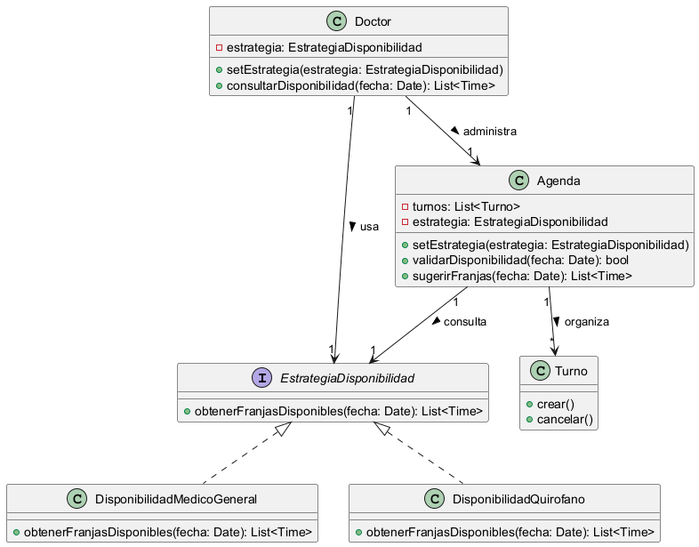

# Principio Abierto/Cerrado (OCP)

## Propósito y Tipo del Principio SOLID

El Principio Abierto/Cerrado (OCP) indica que una clase o módulo debe quedar abierto a la extensión, pero cerrado a la modificación. En términos prácticos, el sistema debería aceptar nuevos comportamientos sin reescribir la lógica estable que ya funciona. En el Sistema de Turnos Médicos este principio es clave porque el dominio tiene variaciones previsibles, como nuevas formas de disponibilidad, distintos tipos de agenda o futuras reglas para múltiples consultorios y salas médicas.

## Motivación

El requisito no funcional RNF3 establece que el sistema debe tener posibilidad de extensión. A partir de la introducción del proyecto y de las tarjetas CRC, se observa que `Doctor` define su disponibilidad general y que `Agenda` configura reglas horarias, valida turnos y sugiere franjas libres. Si ambas clases resolvieran esas variaciones con condicionales rígidos, cada nueva especialidad médica, consultorio o criterio de disponibilidad obligaría a modificar clases centrales del sistema.

En este contexto se eligieron dos clases principales del dominio para aplicar OCP:

1. `Doctor`, porque concentra la configuración de la disponibilidad profesional.
2. `Agenda`, porque utiliza esas reglas para validar turnos y ofrecer franjas disponibles.

La necesidad aparece, por ejemplo, cuando el sistema deba soportar un médico general con agenda estándar, un quirófano con bloques especiales o nuevas restricciones para guardias. La solución no debería forzar cambios reiterados en `Doctor` ni en `Agenda`, sino permitir agregar nuevas variantes reutilizando la estructura existente.

## Explicación de Herencia

En diseño orientado a objetos, una relación de herencia o una jerarquía basada en polimorfismo permite definir un contrato común y múltiples variantes concretas que lo implementan. En esta propuesta, la extensibilidad se modela mediante la interfaz `EstrategiaDisponibilidad`, que actúa como una abstracción compartida para distintas políticas horarias.

La idea es equivalente al uso de herencia para cumplir OCP: el sistema depende de una abstracción y no de una única implementación concreta. De esa manera, nuevas estrategias como `DisponibilidadMedicoGeneral`, `DisponibilidadQuirofano` o una futura `DisponibilidadGuardia` pueden incorporarse sin modificar las clases principales. `Doctor` queda encargado de trabajar con la abstracción y `Agenda` puede consultar la misma estrategia para validar franjas, manteniendo el diseño cerrado a cambios estructurales.

## Estructura de Clases

El siguiente diagrama resume la propuesta de extensibilidad:

[Ver PlantUML del diagrama OCP](../../diagramas/01-diagrama-clases/01-solid-02-ocp.puml)

En el diagrama se modela una estrategia de disponibilidad reutilizable por dos clases principales del sistema:

- `Doctor`, que asigna o cambia la estrategia activa según su modalidad de trabajo.
- `Agenda`, que usa esa estrategia para validar y calcular franjas disponibles antes de registrar un turno.

## Justificación Técnica

La solución propuesta refleja OCP porque las clases principales (`Doctor` y `Agenda`) dejan de depender de reglas codificadas de forma rígida y pasan a depender de la abstracción `EstrategiaDisponibilidad`. Cada implementación concreta encapsula una variación del negocio sin forzar cambios sobre las clases estables del núcleo.

Desde el punto de vista técnico, esto mejora el diseño por tres motivos:

- **Extensibilidad controlada:** nuevas reglas se agregan mediante nuevas implementaciones de la interfaz, sin editar la lógica de `Doctor` ni `Agenda`.
- **Menor acoplamiento:** las clases principales no conocen el detalle interno de cada política de disponibilidad, solo el contrato común.
- **Coherencia con el dominio:** la tarjeta CRC de `Doctor` indica que define disponibilidad general y la de `Agenda` que configura reglas horarias, por lo que ambas clases participan naturalmente del punto de variación.

Con este enfoque, el sistema puede evolucionar para soportar nuevos tipos de atención o recursos médicos manteniendo estable el diseño base. Por eso la propuesta satisface el RNF3 y constituye una aplicación concreta del principio Abierto/Cerrado en dos clases principales del proyecto.