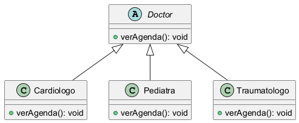

# Principio de Sustitución de Liskov (LSP)

## Propósito y Tipo del Principio SOLID

El Principio de Sustitución de Liskov (LSP) establece que los objetos de una subclase deben poder reemplazar a los objetos de su superclase sin alterar el comportamiento esperado del sistema. Su propósito es garantizar jerarquías de herencia correctas, donde la abstracción defina un contrato estable y las especializaciones lo respeten sin introducir restricciones incompatibles.

En el Sistema de Turnos Médicos esto resulta importante porque el dominio prevé distintas especialidades médicas y la aplicación necesita trabajar sobre la abstracción del profesional sin depender de un subtipo puntual. Si una especialidad cambiara el comportamiento básico esperado por el sistema, se rompería la coherencia del diseño.

## Motivación

La introducción del proyecto y el boceto inicial muestran que el `Doctor` es un actor principal del sistema: consulta su agenda, visualiza pacientes en espera y participa en la atención médica. A medida que el sistema evolucione, es razonable incorporar subtipos como `Cardiologo`, `Pediatra` o `Traumatologo`. El problema aparece si cada subclase redefine las operaciones heredadas de forma incompatible con el contrato base.

Por ejemplo, el caso de uso "Ver agenda" necesita funcionar tanto para un `Doctor` genérico como para cualquier especialidad concreta. Si una subclase exigiera precondiciones adicionales o alterara el sentido de `verAgenda()`, la funcionalidad dejaría de ser segura para el resto del sistema. Por eso LSP se aplica sobre la jerarquía de profesionales, asegurando que las especialidades mantengan el comportamiento esperado por la clase base.

## Explicación de Herencia

En programación orientada a objetos, una relación de herencia expresa una especialización: una subclase reutiliza estado o comportamiento de una superclase y, además, debe seguir siendo compatible con el contrato que esta define. No alcanza con que exista una relación sintáctica `extends`; también debe mantenerse la sustituibilidad semántica.

En esta propuesta, `Doctor` actúa como superclase abstracta con la operación `verAgenda(): void`, mientras que `Cardiologo`, `Pediatra` y `Traumatologo` representan especializaciones válidas. Cada subclase hereda el contrato sin fortalecer precondiciones ni debilitar el comportamiento esperado. De ese modo, cualquier componente que trabaje con la abstracción `Doctor` puede interactuar indistintamente con una especialidad concreta sin requerir lógica adicional ni bifurcaciones especiales.

## Estructura de Clases

El siguiente diagrama resume la jerarquía propuesta:

[Ver PlantUML del diagrama LSP](../../diagramas/01-diagrama-clases/01-solid-03-lsp.puml)

La estructura es deliberadamente simple para destacar el punto central del principio:

- `Doctor` define el contrato general del profesional.
- `Cardiologo`, `Pediatra` y `Traumatologo` extienden a `Doctor` sin alterar la expectativa de uso de la superclase.

### Contrato de `verAgenda()`

El método `verAgenda(): void` representa la capacidad común de todo profesional médico para consultar o mostrar su agenda de turnos. El cliente que invoca esta operación solo necesita saber que está trabajando con un `Doctor`; no debe conocer la especialidad concreta ni preparar condiciones distintas para cada subtipo.

Para respetar LSP, las especialidades deben cumplir este contrato:

- Mantener la misma operación pública `verAgenda(): void`.
- No exigir datos o permisos adicionales que no sean requeridos por `Doctor`.
- No cambiar el significado de la operación; consultar la agenda debe seguir representando la misma responsabilidad del profesional.
- No obligar al cliente a preguntar si el objeto es `Cardiologo`, `Pediatra` o `Traumatologo` antes de usarlo.

## Justificación Técnica

La jerarquía cumple con LSP porque `Cardiologo`, `Pediatra` y `Traumatologo` preservan el contrato de `Doctor`: todos pueden responder a `verAgenda(): void` del mismo modo que se espera de cualquier profesional médico del sistema. Desde el punto de vista del cliente, no importa si la instancia concreta pertenece a una especialidad u otra; la operación sigue siendo válida y coherente con el dominio.

Técnicamente, esto evita tres problemas frecuentes:

- **Precondiciones más fuertes:** la subclase no exige requisitos extra para operar.
- **Comportamiento incompatible:** la especialidad no redefine la operación con un significado distinto.
- **Acoplamiento al subtipo concreto:** el resto del sistema no necesita distinguir si trabaja con `Doctor` o con una especialidad específica.

La propuesta es consistente con el boceto inicial y con las responsabilidades del `Doctor` relevadas en las tarjetas CRC. Por eso, la jerarquía presentada constituye una aplicación válida del Principio de Sustitución de Liskov en el diseño del sistema.
