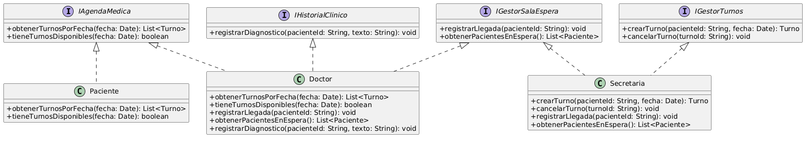

Principio de Segregación de Interfaces (ISP)

### Propósito y Tipo del Principio SOLID
El Principio de Segregación de Interfaces (Interface Segregation Principle) pertenece a los principios de diseño de software SOLID. Su propósito principal es evitar que una clase se vea obligada a depender de interfaces que no utiliza, promoviendo la creación de interfaces pequeñas, cohesivas y altamente especializadas en lugar de interfaces únicas y "gordas" [1].

### Motivación
Al analizar el diseño inicial del Sistema de Turnos Médicos, identificamos clases con responsabilidades muy amplias. Por ejemplo, la clase `Secretaria` mezcla la gestión administrativa de pacientes, la creación de turnos, y la modificación de la agenda. Si creáramos una interfaz genérica `IGestionSecretaria` o `IGestionTurnosMedicos` con todos esos métodos, y obligáramos al `Doctor` o al `Paciente` a implementarla para interactuar con los turnos, estaríamos violando el ISP, ya que el Doctor no necesita crear turnos nuevos, solo verlos o marcarlos como atendidos. Este acoplamiento innecesario haría el sistema frágil ante cambios y obligaría a implementar métodos no utilizados [1, 2].

### Explicación de Interfaces
En la Programación Orientada a Objetos, una interfaz es un contrato abstracto que define un conjunto de comportamientos (métodos) que una clase concreta se compromete a implementar [2]. Aplicar el ISP significa que estas interfaces deben estar diseñadas desde la perspectiva del cliente que las va a usar; deben ser "contratos" específicos para un dominio acotado para asegurar que las clases que las implementan usen el 100% de los métodos definidos [2].

### Estructura de Clases
A continuación se presenta el diagrama de clases modelado con PlantUML que refleja la refactorización aplicando ISP [2]:

### Justificación Técnica
Como se observa en el diagrama UML, en lugar de tener interfaces monolíticas, hemos segregado el comportamiento en interfaces del dominio médico altamente específicas: `IAgendaMedica`, `IGestorTurnos`, `IRegistroSalaEspera`, `IConsultaSalaEspera` e `IHistorialClinico`.

De esta manera, la clase `Doctor` implementa únicamente `IConsultaSalaEspera` e `IHistorialClinico`, lo cual tiene sentido técnico ya que solo necesita visualizar quién está esperando en la sala de espera y registrar diagnósticos en el historial clínico. El Doctor NO implementa `IRegistroSalaEspera` porque no es su responsabilidad registrar la llegada de pacientes.

Por otro lado, la clase `Secretaria` implementa `IGestorTurnos`, `IRegistroSalaEspera` e `IConsultaSalaEspera`, ya que es quien posee la responsabilidad de las operaciones CRUD de turnos (Crear, Modificar, Cancelar) y también gestiona tanto el registro como la consulta de pacientes en la sala de espera.

Esta solución técnica garantiza una alta cohesión (cada interfaz tiene un propósito único) y un bajo acoplamiento, permitiendo que el sistema sea fácilmente extensible en el futuro sin romper código existente [3].