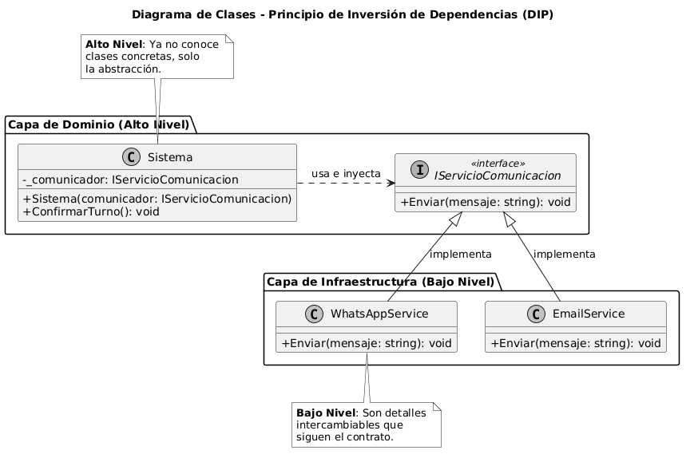

# Principio de Inversión de Dependencias (DIP)

## Propósito y Tipo del Principio SOLID
El Principio de Inversión de Dependencias (DIP) es un principio de **diseño de clases** que aborda el problema de la **rigidez en la arquitectura**. 

**El Problema:** El error común en el diseño de software es permitir que las clases de alto nivel (que contienen las reglas de negocio) dependan directamente de clases de bajo nivel (que realizan tareas técnicas o de infraestructura). Esto genera un sistema frágil: cualquier cambio en una librería externa, una base de datos o un servicio de mensajería obliga a modificar y recompilar el núcleo del sistema, ya que este se encuentra acoplado a implementaciones concretas.

**Cómo ayuda DIP:** Este principio soluciona el problema invirtiendo la dirección de la relación. Establece que la importancia debe recaer en las **abstracciones** (qué debe hacerse) en lugar de las implementaciones (cómo se hace). Al depender de interfaces, el sistema se vuelve modular y desacoplado, permitiendo que los detalles técnicos varíen sin alterar la estabilidad de la lógica de negocio central.

## Motivación
En nuestro **Sistema de Turnos Médicos**, identificamos una necesidad crítica de reducir el acoplamiento para mejorar la mantenibilidad. El diseño inicial presentaba una falla donde la lógica de confirmación de turnos estaba directamente "atada" a un proveedor específico de mensajería (WhatsApp).

**Ejemplo del Proyecto:** Si en el futuro el centro médico decidiera cambiar el canal de comunicación por Email o SMS, o si la API de WhatsApp actualizara sus parámetros técnicos, tendríamos que modificar la clase principal de gestión de turnos. Al aplicar DIP, extraemos esa responsabilidad a una interfaz. Esto permite que la lógica de turnos simplemente "solicite" el envío de una notificación, delegando el detalle técnico a componentes externos intercambiables. Esto reduce el impacto de cambios y permite que el sistema crezca sin riesgo de romper procesos de negocio ya validados.

## Explicación de Clases Abstractas e Interfaces
Para lograr la inversión de dependencias, utilizamos las siguientes herramientas del diseño orientado a objetos:

* **Interfaz:** Es un contrato puramente descriptivo que define un conjunto de métodos que una clase debe implementar, pero no contiene lógica. En DIP, se utiliza para que la clase de alto nivel dependa de una firma de método estable en lugar de una clase volátil.
* **Clase Abstracta:** Es una base que no puede instanciar objetos por sí misma y puede contener tanto métodos con lógica compartida como métodos abstractos (obligatorios para las clases hijas). Se usa cuando varias implementaciones comparten una estructura base pero difieren en su comportamiento específico.

Ambas estructuras permiten que el módulo de alto nivel interactúe con una abstracción, mientras que la implementación concreta se "inyecta" externamente, invirtiendo la jerarquía de dependencia tradicional.

## Estructura de Clases
El siguiente diagrama UML ilustra la transición de dependencias concretas hacia abstracciones e inyección de dependencias en el sistema:

*Archivo fuente:* [01-solid-05-dip.puml](../../diagramas/01-diagrama-clases/01-solid-05-dip.puml)

## Justificación Técnica
Como se observa en el diagrama, la clase de alto nivel (`Sistema`) ya no posee una asociación directa con la clase concreta `WhatsAppService`. En su lugar, se relaciona con la interfaz **`IServicioComunicacion`**.

Esta solución es técnicamente correcta por los siguientes motivos:
1. **Inversión de la Relación:** Las flechas de implementación ahora nacen en los detalles técnicos (`WhatsAppService`, `EmailService`) y apuntan hacia la abstracción. El detalle ahora sirve a la interfaz definida por el dominio.
2. **Inyección de Dependencias:** El diagrama muestra que `Sistema` recibe la interfaz a través de su constructor. Esto garantiza que el módulo de alto nivel sea agnóstico a la implementación utilizada, facilitando la testabilidad mediante el uso de Mocks.
3. **Desacoplamiento Efectivo:** Se cumple con el DIP al proteger el núcleo del sistema de cambios en la infraestructura externa, asegurando una arquitectura flexible y preparada para la evolución del proyecto.