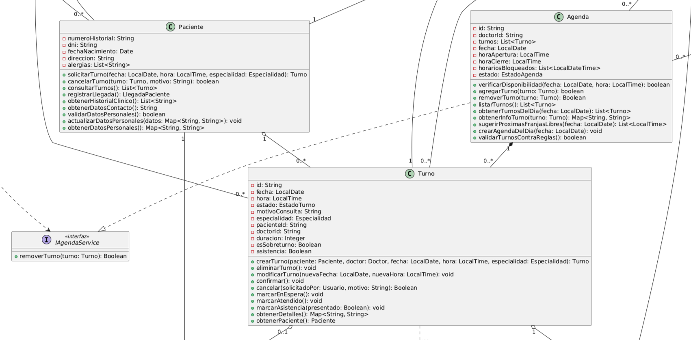

# Encapsulamiento

---

_El encapsulamiento es uno de los pilares de la programación orientada a objetos porque agrupa en una misma entidad sus datos y sus operaciones, ocultando el estado interno y exponiendo solo una interfaz controlada. En el sistema de turnos médicos del Dr. Molina, este principio permite que clases como Paciente, Turno y Agenda gestionen su propia validez, reduciendo la dependencia entre objetos y favoreciendo la cohesión. También se relaciona con los principios SOLID, especialmente con SRP, porque cada clase asume la responsabilidad de proteger su propio estado, y con OCP, porque el comportamiento interno puede evolucionar sin exigir que los clientes del objeto conozcan los detalles de implementación. En diseño, este enfoque facilita el uso de patrones como State para manejar el ciclo de vida de un turno o Repository y Service para separar la lógica de negocio de la persistencia._

---

## Ejemplo en el proyecto

---



> **Ver detalles del diagrama:** [06-clases-diagrama-final.puml](../diagramas/01-diagrama-clases/06-clases-diagrama-final.puml)

### Descripción del Diagrama
En el diagrama final del sistema se eligieron las clases Paciente, Turno y Agenda para ilustrar el encapsulamiento. En ellas se observa el uso de visibilidad privada para atributos como dni, estado, turnos, horariosBloqueados y fecha, mientras que los métodos públicos permiten interactuar con el objeto de forma controlada. Por ejemplo, Turno expone operaciones como confirmar(), cancelar() y marcarAtendido(), que modifican el estado interno sin permitir que otra clase altere directamente los valores sensibles del objeto. Asimismo, Paciente encapsula datos personales como dni, direccion y alergias, y ofrece métodos de alto nivel para validar o actualizar información sin exponer su estructura interna.

### Justificación Técnica
El encapsulamiento se cumple porque el estado de cada objeto queda protegido frente a modificaciones arbitrarias desde el exterior. En el caso de Turno, el atributo estado solo puede cambiar a través de métodos que evalúan reglas de negocio, evitando inconsistencias como pasar de “Reservado” a “Atendido” sin validar el contexto correcto. En Paciente, los datos personales se mantienen privados y se accede a ellos mediante operaciones específicas, lo que garantiza que los datos ingresados respeten condiciones mínimas y que el objeto conserve un estado coherente. Este diseño mejora la integridad del modelo, reduce el acoplamiento y permite evolucionar la implementación interna sin romper el contrato del objeto.

---

## Ejemplo de Código

---

```csharp
public class Turno
{
    private readonly string _id;
    private DateTime _fecha;
    private TimeSpan _hora;
    private EstadoTurno _estado;
    private string _motivoConsulta;

    public Turno(string id, DateTime fecha, TimeSpan hora)
    {
        _id = id;
        _fecha = fecha;
        _hora = hora;
        _estado = EstadoTurno.Disponible;
        _motivoConsulta = string.Empty;
    }

    public string Id => _id;
    public DateTime Fecha => _fecha;
    public TimeSpan Hora => _hora;
    public EstadoTurno Estado => _estado;

    public void Confirmar()
    {
        if (_estado != EstadoTurno.Reservado)
            throw new InvalidOperationException("El turno no puede confirmarse en este estado.");

        _estado = EstadoTurno.Pendiente;
    }

    public void Cancelar(string motivo)
    {
        if (_estado == EstadoTurno.Atendido || _estado == EstadoTurno.Cancelado)
            throw new InvalidOperationException("No se puede cancelar un turno ya atendido o cancelado.");

        _motivoConsulta = motivo;
        _estado = EstadoTurno.Cancelado;
    }

    public void MarcarAtendido()
    {
        if (_estado != EstadoTurno.Pendiente)
            throw new InvalidOperationException("Solo se puede atender un turno pendiente.");

        _estado = EstadoTurno.Atendido;
    }
}
```

### Justificación Técnica del Código
En este fragmento, los atributos `_id`, `_fecha`, `_hora`, `_estado` y `_motivoConsulta` son privados, lo que impide que otras clases modifiquen directamente el estado interno del turno. El acceso a la información se realiza mediante propiedades de lectura (`Id`, `Fecha`, `Hora`, `Estado`) y métodos públicos como `Confirmar()`, `Cancelar()` y `MarcarAtendido()`, que encapsulan las reglas de negocio. Cada operación valida el estado del objeto antes de cambiarlo, garantizando que un turno no pase de un estado inválido a otro sin control. De este modo, la clase Turno preserva la integridad de sus datos y mantiene la coherencia del dominio del sistema de turnos médicos.
