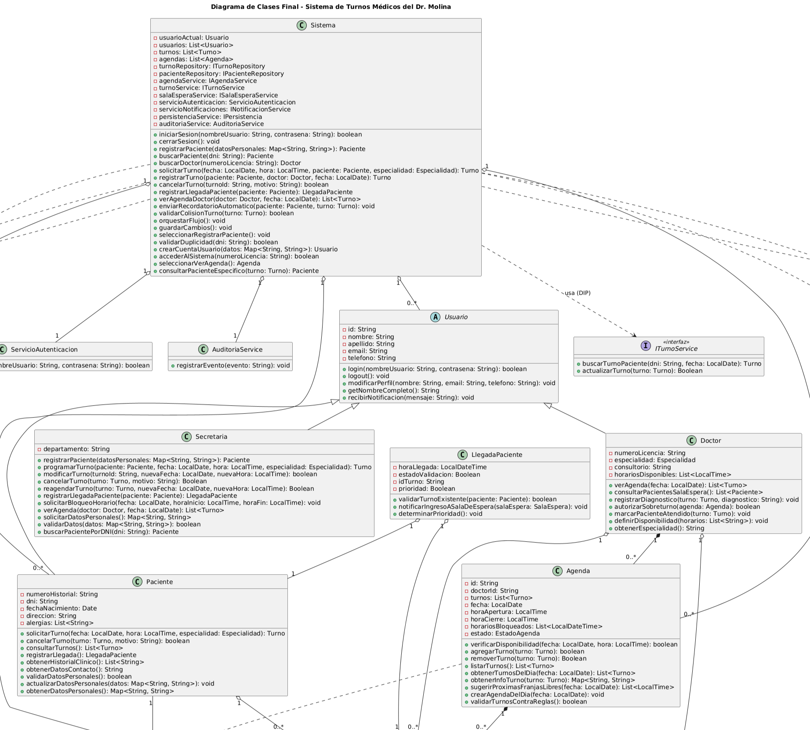

# Polimorfismo

---

_El polimorfismo es uno de los pilares de la programación orientada a objetos porque permite que distintos objetos respondan al mismo mensaje o método de forma específica según su tipo concreto. En el sistema de turnos médicos del Dr. Molina, esta capacidad resulta clave para modelar comportamientos variables como la validación de disponibilidad, el manejo de reglas de negocio y la adaptación de los actores del sistema a situaciones distintas. En términos de diseño, el polimorfismo se relaciona con el principio OCP porque el cliente puede trabajar con abstracciones y recibir nuevas implementaciones sin modificar la lógica central, y con LSP porque las clases concretas pueden sustituir a la abstracción sin romper el contrato esperado. Además, este principio se manifiesta naturalmente en patrones como Strategy, Factory Method y State, donde una misma operación se resuelve de forma distinta según la estrategia o estado activo._

---

## Ejemplo en el proyecto

---



> **Ver detalles del diagrama:** [06-clases-diagrama-final.puml](../diagramas/01-diagrama-clases/06-clases-diagrama-final.puml)

### Descripción del Diagrama
En el diseño del proyecto, el polimorfismo se observa en la relación entre una abstracción y varias implementaciones concretas. Por un lado, la jerarquía de Usuario define un contrato común para operaciones como login(), y las clases Paciente, Doctor y Secretaria responden de manera distinta según el tipo de usuario. Por otro lado, el diseño de la disponibilidad horaria del sistema se apoya en una abstracción de estrategia, donde distintas reglas de negocio pueden aplicarse a la misma operación de validación. De esta manera, el mismo mensaje puede interpretarse de manera diferente según el objeto que lo reciba.

### Justificación Técnica
El diseño permite invocar un método polimórfico sin conocer el tipo concreto del objeto en tiempo de ejecución porque el cliente depende de una abstracción en lugar de una implementación específica. En el caso de los usuarios, el sistema puede invocar login() sobre una referencia de tipo Usuario y obtener una respuesta acorde al tipo real del objeto. En el caso de la disponibilidad, una clase como Agenda puede delegar la validación a una estrategia concreta, y esa estrategia puede cambiarse sin modificar el comportamiento general del sistema. Esto mejora la extensibilidad y reduce el acoplamiento, ya que el código cliente no necesita conocer los detalles internos de cada variante del comportamiento.

---

## Ejemplo de Código

---

```csharp
public abstract class Usuario
{
    public abstract bool Login(string nombreUsuario, string contrasena);
}

public class Paciente : Usuario
{
    public override bool Login(string nombreUsuario, string contrasena)
    {
        return nombreUsuario == "12345678" && contrasena == "clavePaciente";
    }
}

public class Doctor : Usuario
{
    public override bool Login(string nombreUsuario, string contrasena)
    {
        return nombreUsuario == "LIC-001" && contrasena == "claveDoctor";
    }
}

public class Sistema
{
    public bool Autenticar(Usuario usuario, string nombreUsuario, string contrasena)
    {
        return usuario.Login(nombreUsuario, contrasena);
    }
}
```

### Justificación Técnica del Código
El fragmento demuestra polimorfismo porque el método `Login()` se define en la clase base `Usuario` y se implementa de manera distinta en `Paciente` y `Doctor`. Aunque el cliente invoca el mismo mensaje desde `Sistema`, cada clase concreta responde según su propia lógica de autenticación. Esto permite que el sistema trate a todos los usuarios mediante la misma abstracción, sin conocer en tiempo de compilación qué tipo concreto de usuario está recibiendo. Ese comportamiento es el núcleo del polimorfismo y está alineado con los principios SOLID, especialmente con LSP y OCP, porque el cliente depende de un contrato común y las clases derivadas pueden sustituirlo sin romper la lógica general.
